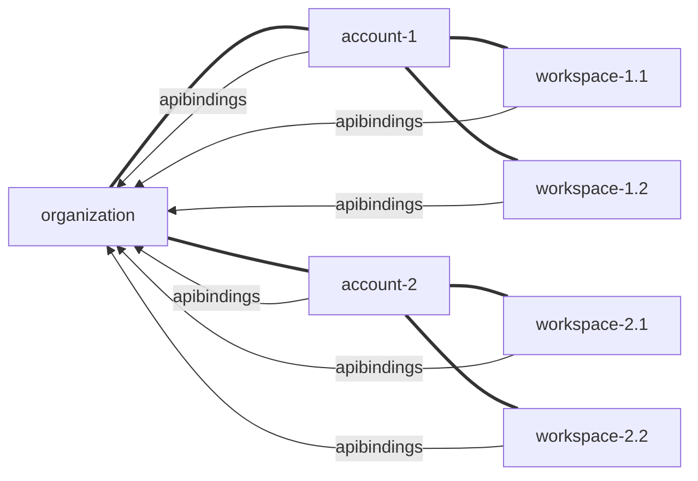

---
# These are optional metadata elements. Feel free to remove any of them.
status: "proposed"
date: 2025-11-11
decision-makers: {aaronschweig, FWuermse, pteich, tjbutz}, 
consulted: {nexus49, tobias-oetzel}
informed: {tjbutz}
---

# Support for a Generic Search Engine within Platform Mesh

## Context and Problem Statement

Currently Platform Mesh does not enable advanced searching such as partial word searches, fuzzy search, or semantic search. That means that every user has to come up with it's own search architecture and permission management within the search and search index.

### Prerequisites

What needs to be in place before implementation can start:
* Choice for a reference search engine (e.g. Solr, Elasticsearch, Open Search)
* Identify if there are current efforts around search in the Apeiro Space

## Decision Drivers

* K8s should be leveraged for data-storage and APIs
* FGA should be leveraged for authorization
* The Apeiro Showroom should benefit from the search 

## Considered Options

* A configurable search engine per account (per-account-search)
* One global search engine with delegated permission management (central-search)
* One global logical search engine per organization in Platform Mesh

## Decision Outcome

Chosen option: "{title of option 1}", because {justification. e.g., only option, which meets k.o. criterion decision driver | which resolves force {force} | … | comes out best (see below)}.

### Consequences

* Good, because {positive consequence, e.g., improvement of one or more desired qualities, …}
* Bad, because {negative consequence, e.g., compromising one or more desired qualities, …}

### Confirmation

TBD

## Pros and Cons of the Options

### per-organization-search

Each KCP workspace below a given organization has it's own search index (collection of documents belonging together) where the index name is the absolute path within KCP.
This means that for all APIResourceSchemas that should be searchable living in workspaces below the organization need to be bound appropriately.



Every time a resource is indexed, an OpenFGA request asserts whether the user is allowed to do this operation (check whether the allowed absolute OpenFGA path matches the search index). When retrieving data the same procedure applies.

Example OpenSearch ingest of `account-2` and `workspace-2.1`:
```json
POST _bulk
{ "create": { "_index": ":root:orgs:organization:account2", "_id": "1" } }
{ "namespace": "default", "APIResourceSchemaName": "MyCustomAPI", "someDomainSpecificField": 123 }
{ "create": { "_index": ":root:orgs:organization:account2:workspace-2.1", "_id": "1" } }
{ "namespace": "default", "APIResourceSchemaName": "MyCustomAPI", "someDomainSpecificField": 456 }
{ "create": { "_index": ":root:orgs:organization:account2:workspace-2.1", "_id": "1" } }
{ "namespace": "default", "APIResourceSchemaName": "OtherCustomAPI", "otherDomainSpecificField": true }
```

Example OpenSearch query returning all `MyCustomAPI` entries for `account-2`:
```json
GET /_msearch
{ "index": ":root:orgs:organization:account2"}
{ "query": { "match": { "APIResourceSchemaName": "MyCustomAPI" } }}
{ "index": ":root:orgs:organization:account2:workspace-2.1", "search_type": "dfs_query_then_fetch"}
{ "query": { "match": { "APIResourceSchemaName": "MyCustomAPI" } } }
```

* Good, because indexing and searching is guarded by openFGA on basis of KCP hierarchies
* Good, because of high flexibility in search scopes
* Good, because of distributed control over indexing
* Bad, because you cannot search across organizations
* Bad, because one logical OpenSearch instance needs to be configured per organization (resources or complexity increases)

### per-account-search

* Good, because fewer openFGA requests needed
* Good, because users can configure the granularity of instances depending on their hierarchies
* Neutral, because configuration has to be provided
* Bad, because implementation effort is greater

### central-search

* Good, because easy to set up
* Neutral, because no configuration needed
* Bad, because implementation details of authentication are complicated
* Bad, because information can potentially leak
* Bad, because too many FGA requests will be needed

## More Information

This ADR is the basis for a Spike where we explore what's possible and develop a proof of concept. Thus, the following features are currently not in scope and may only be relevant once the outcome of the Spike has been explored:

* Search engine is exchangeable
* AI-features (depends on the capabilities of the search engine chosen)
* APIs for non-k8s searchable resources (external DB etc.)