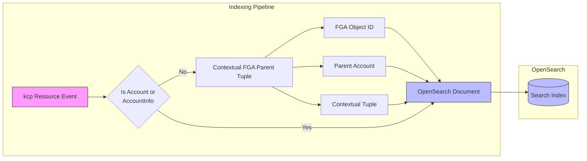
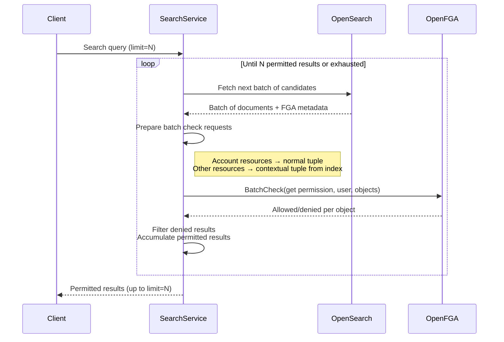

# ADR: Scoping of Search Results in Platform Mesh Search Provider using OpenSearch and FGA

## Status: Proposed

## Deciders:
- TBD

## Date: 2026-04-23

## Technical Story:
Evaluate the implementation approach for search functionality in Platform Mesh, using OpenSearch as the search backend and OpenFGA for permission-aware result filtering.

## Context and Problem Statement

Platform Mesh needs a search capability that allows users to discover and find kcp resources across the platform. The search must respect the existing authorization model built on OpenFGA (Fine-Grained Authorization), ensuring users only see results they are permitted to access.

The key challenges are:
1. Indexing arbitrary, preconfigured kcp resources into a search engine in a way that preserves the authorization context needed for filtering.
2. Efficiently checking permissions for potentially large result sets without degrading search performance.
3. Handling the mismatch between search pagination (fixed batch sizes) and permission filtering (which may remove results from a batch, requiring additional fetches).

## Decision Drivers

1. Need for a scalable, full-text search across arbitrary kcp resources
2. Requirement to enforce FGA-based permissions on all search results
3. Desire to reuse existing FGA infrastructure (security operator, contextual tuples) rather than duplicating authorization logic
4. Need to support both account-level resources (which have direct FGA tuples) and non-account resources (which require contextual tuples)
5. Requirement for consistent pagination behavior from the consumer's perspective
6. Need for acceptable latency even when permission filtering removes a significant portion of results

## Considered Options

### Option 1: OpenSearch with FGA Batch-Check Filtering and Contextual Tuple Enrichment

This option indexes preconfigured kcp resources into OpenSearch, enriching each indexed document with FGA-relevant metadata at index time. At query time, results are fetched in batches and permission-checked against OpenFGA using batch check, with a backfill loop to satisfy the requested page size.

#### Indexing

When a kcp resource is indexed into OpenSearch, the following additional data is stored alongside the resource content:

- **FGA Object**: Every APIResource in kcp has a corresponding FGA object, created and maintained by the security operator. This object identifier is stored in the index to enable permission checks at query time.
- **Parent Account**: The account to which the resource belongs, enabling account-level permission resolution.
- **Contextual Tuple**: For resources that do not have a direct FGA tuple (i.e., non-account-type resources), the contextual tuple that establishes the relationship between the resource and its parent account is stored in the index. This tuple is later used during query-time permission checks.

#### Querying and Permission Filtering

When a search query is executed:

1. The search service queries OpenSearch and retrieves a batch of candidate results.
2. For each result in the batch, a permission check is prepared:
   - **Account-type resources**: These have a direct FGA tuple (the account itself is an FGA object with existing relations). The batch check uses the normal tuple.
   - **Non-account-type resources**: These do not have a direct FGA tuple. The contextual tuple stored in the index at indexing time is supplied to the batch check call.
3. All checks in the batch are for the `get` permission against the requesting user.
4. Results that fail the permission check are filtered out.
5. If filtering reduces the result count below the requested page size (`limit`), another batch is fetched from OpenSearch (continuing from where the previous batch left off) and the process repeats.
6. This loop continues until either:
   - Enough permitted results have been collected to satisfy the requested `limit`, or
   - All matching documents in OpenSearch have been exhausted.

#### Pros:
- Leverages existing FGA infrastructure — no duplication of authorization logic
- Contextual tuples stored at index time avoid runtime lookups to reconstruct authorization context
- Batch check minimizes the number of round trips to OpenFGA
- OpenSearch provides robust full-text search, relevance scoring, and aggregation capabilities
- The backfill loop ensures consumers always receive the expected number of results (when available), hiding the complexity of permission filtering
- Indexing arbitrary kcp resources is flexible and can be configured per platform deployment
- Clear separation of concerns: OpenSearch handles search, OpenFGA handles authorization

#### Cons:
- Latency may increase when a large proportion of results are filtered out, requiring multiple batches
- Contextual tuples stored in the index must be kept in sync with FGA state — stale tuples could lead to incorrect permission decisions
- The backfill loop adds complexity to the search service and makes query latency less predictable
- Batch check calls to OpenFGA scale linearly with batch size, which could become a bottleneck under high load
- OpenSearch index must be kept in sync with kcp resource state and FGA object state independently

#### Important Considerations:
- Batch size tuning is critical: too small increases round trips, too large wastes FGA batch check capacity on results that may not be needed
- A maximum iteration cap on the backfill loop should be implemented to prevent runaway queries when a user has very limited permissions
- Monitoring should track the ratio of fetched-to-returned results per query to identify users or queries where permission filtering is disproportionately expensive
- Index update strategy (real-time vs. near-real-time) needs to be defined, considering the trade-off between freshness and indexing load
- Contextual tuple invalidation/refresh strategy is needed to handle FGA policy changes that affect indexed tuples

## Decision Outcome (Proposed)

Option 1 is the only option evaluated so far and is proposed as the implementation approach. It aligns well with the existing Platform Mesh architecture by reusing the FGA model maintained by the security operator and leveraging OpenSearch for search.

### Positive Consequences

1. Authorization Consistency:
- Search results are filtered using the same FGA model that governs API access
- No risk of search returning resources a user cannot access via normal API calls
- Contextual tuples ensure non-account resources are checked with full authorization context

2. Architectural Simplicity:
- Reuses existing FGA infrastructure rather than introducing a parallel authorization mechanism for search
- OpenSearch is a well-understood, battle-tested search engine
- The indexing enrichment pattern is straightforward and fits naturally into the existing resource lifecycle

3. Flexibility:
- Preconfigured arbitrary kcp resources can be indexed and the system is not hardcoded to specific resource types
- New resource types can be added to the search index without changes to the query/filtering logic

### Negative Consequences

1. Performance Uncertainty:
- The backfill loop introduces variable latency depending on permission hit rate
- Under adversarial or pathological conditions (user has access to very few resources), query performance may degrade significantly

2. Operational Complexity:
- Two systems (OpenSearch and OpenFGA) must be kept in sync with kcp state
- Stale index data or stale contextual tuples could produce incorrect results
- Monitoring and alerting must cover the indexing pipeline, search service, and FGA batch check performance

## Risk Mitigation

1. Performance Risks:
- Implement configurable batch sizes and maximum backfill iterations
- Monitor permission hit rate per query and alert on consistently low ratios
- Consider pre-filtering strategies (e.g., adding account-level filters to the OpenSearch query) to reduce the number of results that need FGA checking

2. Data Staleness Risks:
- Implement index refresh on resource and FGA object changes
- Define SLO for index freshness (e.g., resources are searchable within N seconds of creation)
- Add reconciliation jobs to detect and repair index drift

3. Availability Risks:
- Define degraded behavior when OpenFGA is unavailable (fail closed — return no results rather than unfiltered results)
- Consider OpenSearch replica configuration for search availability

## Action Items

1. Define the set of kcp resources to index in the initial implementation
2. Design the OpenSearch index schema including FGA metadata fields
3. Implement the indexing pipeline with FGA enrichment
4. Implement the search service with batch check and backfill loop
5. Define and implement batch size tuning and backfill iteration limits
6. Set up monitoring for search latency, permission hit rate, and index freshness
7. Define SLOs for search latency and index freshness
8. Evaluate pre-filtering strategies to improve permission hit rate

## Related Documents

- OpenFGA Documentation
- OpenSearch Documentation
- Platform Mesh Security Operator Documentation

## Notes

This is a living document and should be updated as implementation progresses. Currently only one option has been evaluated. Additional options (e.g., pre-computed permission-aware indexes, search proxied through kcp with native authorization) should be evaluated if Option 1 proves insufficient during implementation.
