# ADR 008: Provider Permissions Configuration

## Context and Problem Statement

Currently for provider's API Platform Mesh generates AuthorizationModel resource with default relations within the Kubernetes. For example, an AuthorizationModel for example-data provider looks like this:

```
module httpbins

extend type core_namespace
  relations
    define create_orchestrate_platform-mesh_io_httpbins: owner
    define list_orchestrate_platform-mesh_io_httpbins: member
    define watch_orchestrate_platform-mesh_io_httpbins: member

type orchestrate_platform-mesh_io_httpbin
  relations
    define parent: [core_namespace]
    define owner: [role#assignee] or owner from parent
    define member: [role#assignee] or owner or member from parent
    
    define get: member
    define update: member
    define delete: member
    define patch: member
    define watch: member

    define manage_iam_roles: owner
    define get_iam_roles: member
    define get_iam_users: member
```

And it's not flexible right now. With this feature we want to introduce the ability for providers to add their own relations and roles for an API they introduce. It should support the following functionality:

* Alter/overwrite the auto-generated relations of a resource
* Give the possibility to define new relations
* Introduce the possibility to define new roles (IAM service needs to know about them)

## Decision
1. Introduce a CRD which will be responsible for extending/overwriting relations which are defined in AuthorizationModel
2. CRs of this CRD will be owned by provider and will be created in provider's workspace alongside of the ApiExport, ApiResourceSchema, ContentConfiguration, ProviderMetadata, and other provider's resources.
3. Provider cannot overwrite relations for types in OpenFGA which they don't own. For example, a provider cannot overwrite relations for an API of another provider or for default Kubernetes resources.

## Flow of work
1. Provider creates ProviderPermissions resource in provider's workspace. It might happen as at the moment when AuthorizationModel already exists or after it
2. Security-operator reconciles ApiBinding resource when somebody binds provider's API. At this moment security-operator generates AuthorizationModel resources based on bound `ApiResourceSchema` resources. At this moment security-operator will check if there is a defined `ProviderPermissions` resource and if so, security-operator will merge relations from `ProviderPermissions` and the default `AuthorizationModel`.
3. When `AuthorizationModel` is written into the cluster, store reconciliation will be triggered and the updated `AuthorizationModel` will reach OpenFGA.

```mermaid
---
config:
  theme: base
  themeVariables:
    fontSize: 20px
    fontFamily: arial
    background: "#ffffff"
  layout: fixed
---
flowchart LR
 subgraph Inputs["Data for AuthorizationModel generation"]
        AB["APIBinding"]
        PP["ProviderPermissions"]
  end
 subgraph Webhook["Webhook"]
        VAL["Validates ProviderPermissions<br><br>• DSL syntax validation<br>• Roles match relations"]
  end
 subgraph AMC["APIBinding Controller<br>AuthorizationModelGenerationSubroutine"]
        W["Watches:<br>• APIBinding<br>• ProviderPermissions"]
        G["Generate base model<br>from APIResourceSchema"]
        M["Merge ProviderPermissions<br>override matching relations"]
        U["Update<br>AuthorizationModel"]
  end
 subgraph Resources["Resources"]
        AM["AuthorizationModel<br>spec.Model = base + PP"]
  end
 subgraph SC["Store Controller"]
        S["Reads AM.spec.Model<br>Writes to OpenFGA"]
  end
    W --> G
    G --> M
    M --> U
    Webhook --> PP
    AB -- watch --> W
    PP -- watch --> W
    U -- creates/updates --> AM
    AM -- watch --> S
    S --> FGA[("OpenFGA")]

    style Webhook fill:#ffccd2
    style AMC fill:#fff3e0
    style SC fill:#e8f5e9
    style Inputs fill:#e3f2fd
    style Resources fill:#f3e5f5
```



## Open questions
1. Should we allow providers to add their roles into existing resources and into the account, or should they operate only over their own API? In the latter case, security-operator should be in charge of properly integrating new roles. 

### OpenFGA DSL Syntax

Relations are defined using the following syntax:

```
define <relation_name>: <relation_definition>
```

Where `<relation_definition>` can include:

| Syntax | Meaning | Relation Type |
|--------|---------|---------------|
| `[user]` | Direct assignment — a `user` can be directly assigned this relation. | Direct |
| `[user:*]` | Direct wildcard — any object of type `user` has this relation (useful for public access). | Wildcard |
| `[user, team#member]` | Direct assignment from multiple types — a `user` or a `member` of a `team`. | Direct Userset |
| `member` | Computed userset — anyone with the `member` relation has this relation. | Computed / Alias |
| `owner from parent` | Tuple-to-userset — inherit from a related object's relation. | Inherited |
| `[user] or member` | Union — direct assignment OR inheritance from another relation. | Logical OR |
| `writer and owner` | Intersection — must satisfy BOTH conditions (Schema 1.1+). | Logical AND |
| `[user] but not blocked` | Exclusion — must satisfy the first condition and NOT the second (Schema 1.1+). | Logical NOT |
| `[user with condition_name]` | Conditional — direct assignment subject to a context condition evaluating to `true` (Schema 1.1+). | ABAC / Conditional |

The variety of options for defining relations makes it hard to propose a typed way of defining them.

### ProviderPermissions Resource Definition

The `ProviderPermissions` CR allows providers to define OpenFGA-style types and relations for their resources. A single CR can define multiple types, each with its own set of relations expressed as strings in OpenFGA DSL format.

```yaml
apiVersion: core.platform-mesh.io/v1alpha1
kind: ProviderPermissions
metadata:
  name: orchestrate.platform-mesh.io  # matches the APIExport name
spec:
  # Reference to the APIExport this config applies to
  apiExportRef:
    name: orchestrate.platform-mesh.io

  # Roles metadata for UI display (id must match a relation name in types)
  roles:
    - id: codeviewer
      displayName: Code Viewer
      description: Can view code and related resources.
    - id: admin
      displayName: Admin
      description: Administrative access with elevated permissions.

  # OpenFGA types and their relations. Type name matches the type name from AuthorizationModel. 
  # Relations section represents relations which extend the default AuthorizationModel or override 
  # relations from it.
  types:
    - name: orchestrate_platform-mesh_io_httpbin
      relations:
        # New custom roles
        - "define codeviewer: [role#assignee] or member"
        - "define admin: [role#assignee] or owner"
        # Custom permissions (not auto-generated)
        - "define view_source: codeviewer or admin"
        - "define run_scan: admin"
        - "define export_data: member or codeviewer"
        - "define manage_config: admin or owner"
        # Override of default relations
        - "define manage_iam_roles: owner"

status:
  conditions:
    - type: Ready
      status: "True"
    - type: RelationsValid
      status: "True"
      message: "All relations parsed successfully"
```

The operator parses the OpenFGA DSL strings at runtime and validates them against the OpenFGA grammar.

### Validation

The operator must validate that a provider can only define permissions for resources it owns. This prevents a malicious or misconfigured provider from overwriting permissions for another provider's or system resources.

Validation rules:
- The type names declared in `spec.types[].name` must correspond to API resources exposed by the referenced `apiExportRef`
- The validation webhook rejects any `ProviderPermissions` CR that attempts to define types not owned by the provider. Alternatively, the operator may skip types configured in the ProviderPermissions resource which do not match ApiResourceSchema resources from the ApiExport.

### Override Behavior

When relations defined in a `ProviderPermissions` resource match existing permissions in the `AuthorizationModel` resource, the operator uses the relations from `ProviderPermissions` as the source of truth. This allows providers to customize the default permission model for their resources.

### Roles Metadata

The `roles` section in `ProviderPermissions` exists to support UI and iam-service integration. While OpenFGA only needs the relation definitions in the `types` section, the UI and iam-service require additional metadata to provide a complete role management experience.

This separation allows:
- **UI** to display human-readable role names and descriptions in role assignment dialogs
- **iam-service** to enumerate available roles for a provider's resources and expose them via API
- **Providers** to define their own custom roles with meaningful descriptions that end users can understand

The `id` field must match a relation name defined in the `types` section. The validation webhook validates this correspondence and reports mismatches in the status conditions.

When a provider introduces a new custom role (e.g., `reviewer`), the operator must also add this role to both the `core_platform-mesh_io_account` and `core_namespace` type schemas in the authorization model. This is required because roles are assigned at the account level and `core_namespace` serves as the parent for provider-generated APIs — both types need to know about all available roles that can be inherited down the hierarchy.

### Finalization

When a `ProviderPermissions` CR is deleted, the operator will just regenerate AuthorizationModel without relations from `ProviderPermissions` resource.