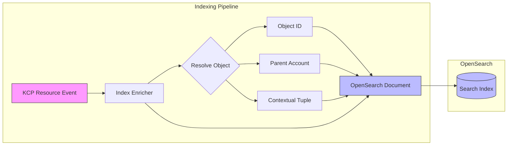
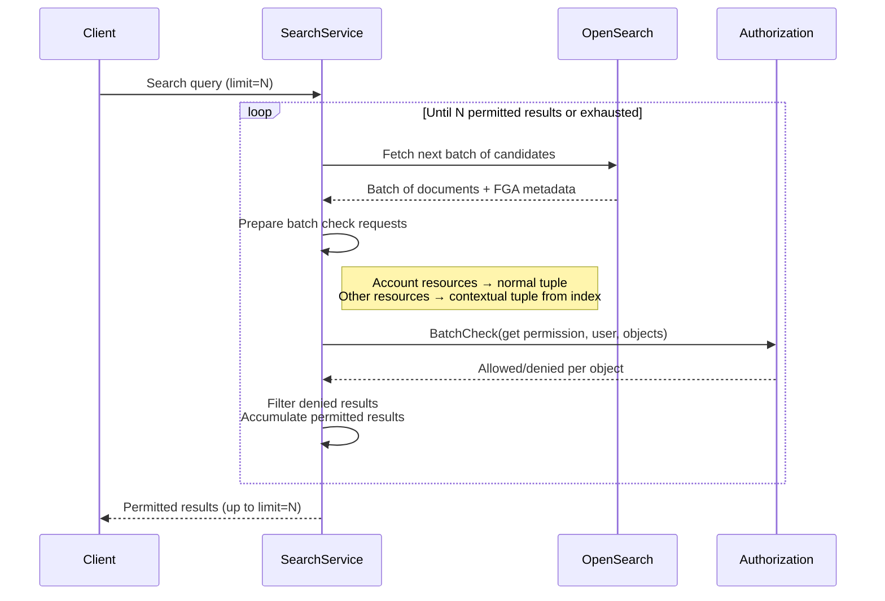
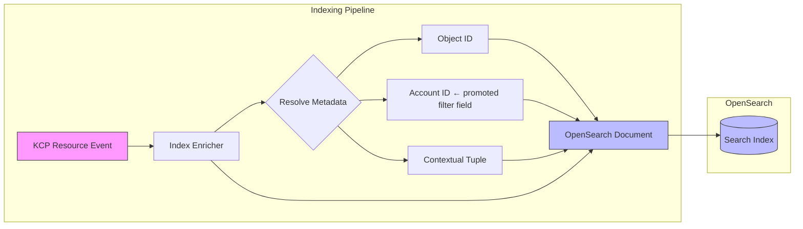
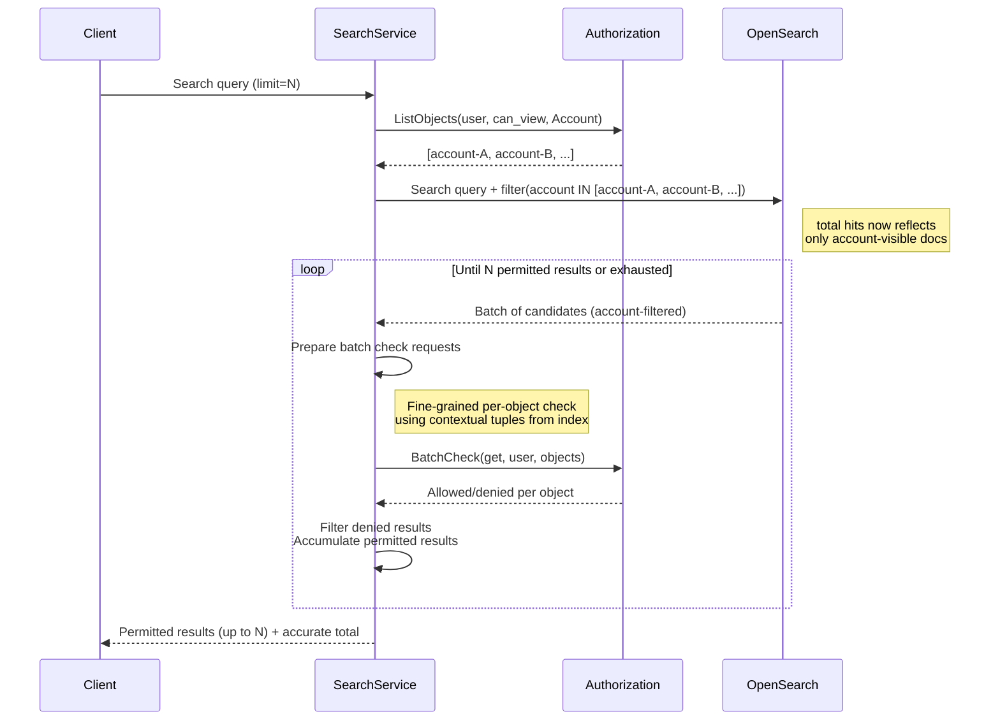

# ADR: Search Implementation in Platform Mesh using OpenSearch and Authorization

## Status: Proposed

## Deciders:
- TBD

## Date: 2026-03-26

## Technical Story:
Evaluate the implementation approach for search functionality in Platform Mesh, using OpenSearch as the search backend and Authorization Backend for permission-aware result filtering.

## Context and Problem Statement

Platform Mesh needs a search capability that allows users to discover and find KCP resources across the platform. The search must respect the existing authorization model, ensuring users only see results they are permitted to access.

The key challenges are:
1. Indexing arbitrary, preconfigured KCP resources into a search engine in a way that preserves the authorization context needed for filtering.
2. Efficiently checking permissions for potentially large result sets without degrading search performance.
3. Handling the mismatch between search pagination (fixed batch sizes) and permission filtering (which may remove results from a batch, requiring additional fetches).

## Decision Drivers

1. Need for a scalable, full-text search across arbitrary KCP resources
2. Requirement to enforce permissions on all search results
3. Desire to reuse existing authorization infrastructure (security operator, contextual tuples) rather than duplicating authorization logic
4. Need to support both account-level resources (which have direct authorization information) and non-account resources (which require contextual authorization checks)
5. Requirement for consistent pagination behavior from the consumer's perspective
6. Need for acceptable latency even when permission filtering removes a significant portion of results

## Considered Options

### Option 1: OpenSearch with Batch-Check Filtering and Contextual Tuple Enrichment

This option indexes preconfigured KCP resources into OpenSearch, enriching each indexed document with authorization metadata at index time. At query time, results are fetched in batches and permission-checked against Platform Mesh authorization using batch check, with a backfill loop to satisfy the requested page size.

#### Indexing

When a KCP resource is indexed into OpenSearch, the following additional data is stored alongside the resource content:

- **Authorization Object**: Every APIResource in KCP has a corresponding object, created and maintained by the security operator. This object identifier is stored in the index to enable permission checks at query time.
- **Parent Account**: The account to which the resource belongs, enabling account-level permission resolution.
- **Contextual Tuple**: For resources that do not have a direct tuple (i.e., non-account-type resources), the contextual tuple that establishes the relationship between the resource and its parent account is stored in the index. This tuple is later used during query-time permission checks.

#### Querying and Permission Filtering

When a search query is executed:

1. The search service queries OpenSearch and retrieves a batch of candidate results.
2. For each result in the batch, a permission check is prepared:
   - **Account-type resources**: These have a direct tuple (the account itself is an object with existing relations). The batch check uses the normal tuple.
   - **Non-account-type resources**: These do not have a direct tuple. The contextual tuple stored in the index at indexing time is supplied to the batch check call.
3. All checks in the batch are for the `get` permission against the requesting user.
4. Results that fail the permission check are filtered out.
5. If filtering reduces the result count below the requested page size (`limit`), another batch is fetched from OpenSearch (continuing from where the previous batch left off) and the process repeats.
6. This loop continues until either:
   - Enough permitted results have been collected to satisfy the requested `limit`, or
   - All matching documents in OpenSearch have been exhausted.

#### Pros:
- Leverages existing FGA infrastructure — no duplication of authorization logic
- Contextual tuples stored at index time avoid runtime lookups to reconstruct authorization context
- Batch check minimizes the number of round trips
- OpenSearch provides robust full-text search, relevance scoring, and aggregation capabilities
- The backfill loop ensures consumers always receive the expected number of results (when available), hiding the complexity of permission filtering
- Indexing arbitrary KCP resources is flexible and can be configured per platform deployment
- Clear separation of concerns: OpenSearch handles search, Platform Mesh handles authorization

#### Cons:
- Latency may increase when a large proportion of results are filtered out, requiring multiple batches
- Contextual tuples stored in the index must be kept in sync with FGA state — stale tuples could lead to incorrect permission decisions
- The backfill loop adds complexity to the search service and makes query latency less predictable
- Batch check calls to Platform Mesh scale linearly with batch size, which could become a bottleneck under high load
- OpenSearch index must be kept in sync with KCP resource state and FGA object state independently

#### Important Considerations:
- Batch size tuning is critical: too small increases round trips, too large wastes FGA batch check capacity on results that may not be needed
- A maximum iteration cap on the backfill loop should be implemented to prevent runaway queries when a user has very limited permissions
- Monitoring should track the ratio of fetched-to-returned results per query to identify users or queries where permission filtering is disproportionately expensive
- Index update strategy (real-time vs. near-real-time) needs to be defined, considering the trade-off between freshness and indexing load
- Contextual tuple invalidation/refresh strategy is needed to handle FGA policy changes that affect indexed tuples

### Option 2: Account-Scoped Pre-filtering with Authorization Query and Post-check

This option extends Option 1 by adding the **linked Account** for each indexed resource as a first-class field in the OpenSearch document. Before running the full search, the search service queries the Authorization Backend to determine which Accounts the requesting user can see. This account list is then injected as a filter into the OpenSearch query, so only documents belonging to visible accounts are ever returned. The FGA batch-check post-filter from Option 1 is retained for fine-grained object-level permission enforcement, but now operates on a significantly reduced and more predictable candidate set.

#### Indexing

Identical to Option 1, with one addition: the **Account identifier** (the KCP account to which the resource belongs) is stored as a dedicated, filterable field in the OpenSearch document. This field already exists logically in Option 1 as "Parent Account" but is promoted here to be the primary pre-filter dimension.

#### Querying and Permission Filtering

When a search query is executed:

1. **Account visibility query**: The search service calls the Authorization Backend with a `ListObjects` (or equivalent) query: *"which Accounts can this user see?"* The result is a list of Account identifiers the user is permitted to access.
2. **Account-scoped OpenSearch query**: The original search query is augmented with a filter on the `account` field, restricting candidates to documents belonging to the visible accounts. This happens before any pagination math, so OpenSearch's `total` hit count reflects only account-accessible documents.
3. **batch-check post-filter** (same as Option 1): Results are still checked individually via batch check for fine-grained object-level permissions (e.g., a user may have account access but not `get` on a specific resource).
4. **Accurate totals**: Because the OpenSearch query is already scoped to visible accounts, the `total` returned by OpenSearch is a tight upper bound on what the user can see.
5. **Backfill loop** (same as Option 1): If fine-grained post-filtering removes results from a page, additional batches are fetched and checked until the page is satisfied or all candidates are exhausted. With account pre-filtering in place, this loop runs over a much smaller and more predictable candidate set.

#### Pros:
- **Accurate totals**: The count returned to the client reflects only documents in accounts the user can actually see, avoiding inflated totals from inaccessible accounts
- **Fewer or no backfill iterations**: The candidate pool is already scoped to accessible accounts, so fine-grained post-filtering is just a safeguard 
- **Correct semantics for account-level access**: Account membership is the dominant access control dimension in Platform Mesh . Pre-filtering on it aligns the search behavior with user expectations
- **All Pros of Option 1 are preserved**: Contextual tuples, batch check, OpenSearch full-text capabilities, and architectural separation of concerns all remain

#### Cons:
- **IAM Service does not offer such a query right now** This query is essential for Option 2 and is not yet offered by the IAM GraphQL service
- **Additional Authorization round trip**: The `ListObjects` call for visible accounts adds one extra request to every search query; this can be mitigated with short-lived caching (e.g., per-request or per-session cache with a TTL of a few seconds)

## Decision Outcome (Proposed)

Option 1 is currently proposed as the baseline implementation approach. Option 2 is under evaluation as a refinement that addresses Option 1's inaccurate totals and unpredictable backfill behavior. It aligns well with the existing Platform Mesh architecture by reusing the FGA model maintained by the security operator and leveraging OpenSearch for search.

### Positive Consequences

1. Authorization Consistency:
- Search results are filtered using the same FGA model that governs API access
- No risk of search returning resources a user cannot access via normal API calls
- Contextual tuples ensure non-account resources are checked with full authorization context

2. Architectural Simplicity:
- Reuses existing FGA infrastructure rather than introducing a parallel authorization mechanism for search
- OpenSearch is a well-understood, battle-tested search engine
- The indexing enrichment pattern is straightforward and fits naturally into the existing resource lifecycle

3. Flexibility:
- Preconfigured arbitrary KCP resources can be indexed — the system is not hardcoded to specific resource types
- New resource types can be added to the search index without changes to the query/filtering logic

### Negative Consequences

1. Performance Uncertainty:
- The backfill loop introduces variable latency depending on permission hit rate
- Under adversarial or pathological conditions (user has access to very few resources), query performance may degrade significantly

2. Operational Complexity:
- Two systems (OpenSearch and the Authorization API) must be kept in sync with KCP state
- Stale index data or stale contextual tuples could produce incorrect results
- Monitoring and alerting must cover the indexing pipeline, search service, and FGA batch check performance

## Risk Mitigation

1. Performance Risks:
- Implement configurable batch sizes and maximum backfill iterations
- Monitor permission hit rate per query and alert on consistently low ratios
- Consider pre-filtering strategies (e.g., adding account-level filters to the OpenSearch query) to reduce the number of results that need FGA checking

2. Data Staleness Risks:
- Implement index refresh on resource and FGA object changes
- Define SLO for index freshness (e.g., resources are searchable within N seconds of creation)
- Add reconciliation jobs to detect and repair index drift

3. Availability Risks:
- Define degraded behavior when Platform Mesh's Authorization API is unavailable (fail closed — return no results rather than unfiltered results)
- Consider OpenSearch replica configuration for search availability

## Action Items

1. Define the set of KCP resources to index in the initial implementation
2. Design the OpenSearch index schema including FGA metadata fields
3. Implement the indexing pipeline with FGA enrichment
4. Implement the search service with batch check and backfill loop
5. Define and implement batch size tuning and backfill iteration limits
6. Set up monitoring for search latency, permission hit rate, and index freshness
7. Define SLOs for search latency and index freshness
8. Evaluate pre-filtering strategies to improve permission hit rate

## Related Documents

- ADR 01: Account Model Implementation in Platform Mesh using KCP
- OpenSearch Documentation
- Platform Mesh Security Operator Documentation

## Notes

This is a living document and should be updated as implementation progresses. Two options have been evaluated. Option 2 (account-scoped pre-filtering) is the preferred direction if `ListObjects` query performance is validated to be acceptable at scale. Additional options (e.g., pre-computed permission-aware indexes, search proxied through KCP with native authorization) should be evaluated if neither Option 1 nor Option 2 proves sufficient during implementation.