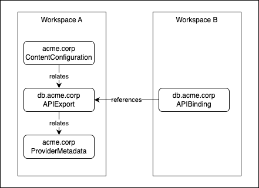
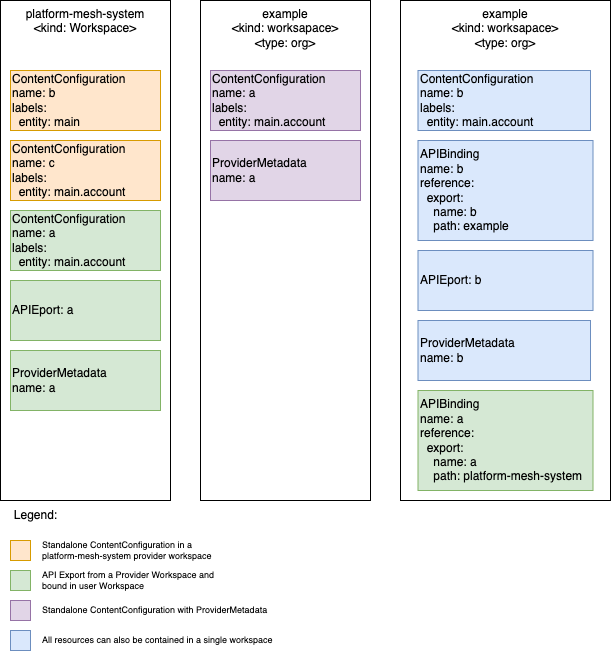
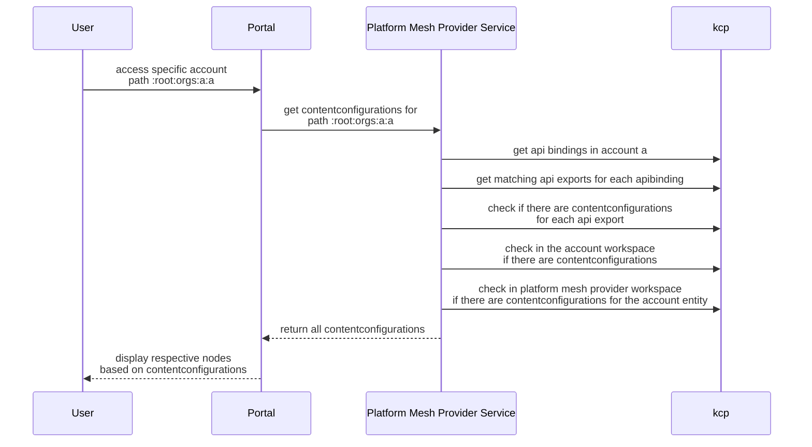
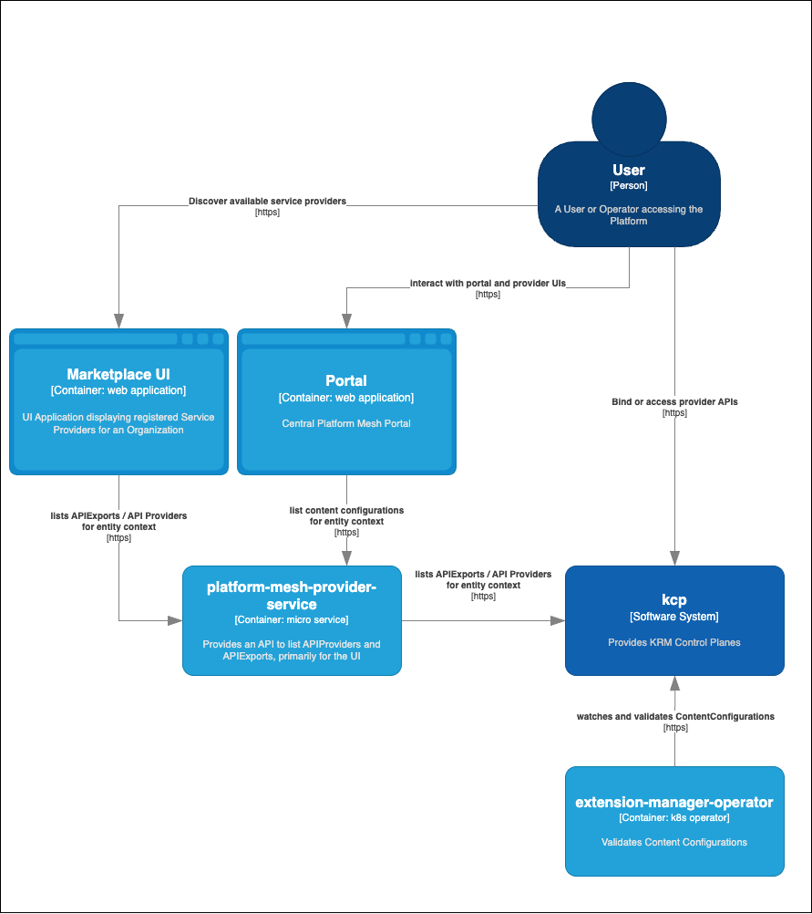

# RFC: API Provider Data and Provider UI Discovery in Platform Mesh

| Status  | Proposed                                                     |
|---------|--------------------------------------------------------------|
| Author  | @nexus49                                                     |
| Created | 2025-07-01                                                   |
| RFC PR  | [link](https://github.com/platform-mesh/architecture/pull/1) |

## Summary

This RFC proposes a mechanism for managing API provider metadata and UI discovery within Platform Mesh. It introduces new resources to address gaps in KCP's core resources, enabling richer provider metadata, controlled API binding, and dynamic UI integration for workspaces.

## Context and Problem Statement

Platform Mesh leverages KCP to provide a central KRM-based control plane. KCP introduces resources such as `APIExport`, `APIBinding`, `APIResourceSchema`, and `Workspace` for API registration and binding.

However, several concerns are not addressed by these core resources:

- **Provider Metadata**: There is no standard way to attach metadata (name, description, icon, website, support, docs, etc.) to API providers for discovery purposes.
- **Binding Constraints**: Not all APIs should be bindable by any workspace; some APIs may be organization-specific and require binding constraints.
- **Provider UI Registration**: Providers may want to register UIs for integration into the Platform Mesh portal, visible only in relevant workspaces.

This RFC proposes solutions to address these gaps, some of which may be candidates for KCP core, while others remain platform-mesh specific.

## Motivation

- Enhance discoverability and management of API providers.
- Enable fine-grained control over which workspaces can bind to specific APIs.
- Support dynamic UI integration for providers within the portal.

## Proposal

### API Provider Metadata

- Provider metadata should be co-located with other provider resources, ideally in the same workspace as the `APIExport`.
- Metadata should be optional, as not all APIs require a provider or relevant metadata.
- A provider may own multiple `APIExport` resources; thus, metadata should be a separate resource, referenced from `APIExport`.

#### New Resource: `ProviderMetadata`

Introduce an `ProviderMetadata` resource to store provider metadata. It should be possible to associate an `ProviderMetadata` with an `APIExport` via an optional field, label, or annotation.

**Example:**
```yaml
apiVersion: api.platform-mesh.io/v1alpha1
kind: ProviderMetadata
metadata:
  name: acme-example-provider
spec:
  tags:
    - infra
    - eu
  description: This is the acme example provider corp.
  displayName: ACME Example Provider corp
  icon:
    dark:
      url: "https://myimage.com/image.png"
    light:
      url: "https://myimage.com/image.png"
  contacts:
    - displayName: John Doe
      email: jd@acme.corp
      roles:
        - support
        - sales
      contactLink: "https://acme.corp/contact/jd"
  documentation:
    - name: API Documentation
      url: "https://acme.corp/docs"
    - name: End User Documentation
      url: "https://acme.corp/end-user-docs"
  links:
    - name: Website
      url: "https://acme.corp"
      default: true
    - name: Wiki
      url: "https://acme.corp/wiki"
  preferredSupportChannels:
    - name: Support
      url: "https://acme.corp/support"
  helpCenterData:
    - name: Issue Tracker
      url: "https://acme.corp/issues"
    - name: Feedback Tracker
      url: "https://acme.corp/feedback"
```
*Note: The schema is illustrative and can be extended as needed.*

### UI Discovery and Provider UI Binding

- Provider UI configuration should be co-located with other provider resources in the same workspace as the `APIExport`.
- OpenMFP uses `ContentConfiguration` resources for UI configuration; these should not be duplicated across workspaces.
- Make use of the already existing binding relation (`APIBinding`) between the api export in the workspace. This is beneficial over adding a binding resource for the content configuration.
- The ContentConfiguration resource can act as a UI configuration for a APIExport, but we should also support ContentConfigurations without API relation. 
  In that situation we still need to create a releation to the ProvderMetadata for example for future "help center" features. in order to route users to a page specific help content.

**Example: ContentConfiguration**
```yaml
apiVersion: ui.platform-mesh.io/v1alpha1
kind: ContentConfiguration
metadata:
  name: acme.provider.io
   # The following labels / annotations (/content-for, /metadata) are mutually exclusive, if both are set the ProviderMetadata will be used via the APIExport.
   # The following label would be set to relate the ContentConfiguration to an APIExport.
  labels:
    ui.platform-mesh.ui/entity: account # this is the matching ui entity e.g. if a UI should be visible on the global or account level. 
    # ui.platform-mesh.io/content-for: "acme.example.corp"
  # The following annotaton would be set to relate the ContentConfiguration to an ProviderMetadata 
  # annotations:
    # ui.platform-mesh.io/metadata: "acme.example.corp"
spec:
  # Either inline or remote configuration can be used.
  inlineConfiguration:
    content: |-
      {
        <!-- This is a JSON object that configures the UI to be integrated -->
      }
    contentType: json
  remoteConfiguration:
    url: "https://my-ui.com/config.json"
    contentType: json
```

For the case where we have a standalone `ContentConfiguration` we need to be able to find the relevant `ProviderMetadata` for a given `ContentConfiguration`. 
Here we can use a `ui.platform-mesh.io/metadata` annotation to get the matching `ProviderMetadata` resource.

**Overview**



## ContentConfiguration Locations and how to gather the applicable ContentConfigurations

The below diagram illustrates various examples of how the `ContentConfiguration` resources can be located and how they relate to the `APIExport` and `ProviderMetadata` resources.



The platform mesh service would need to follow the following sequence of actions to gather all relevant `ContentConfiguration` resources:


## Operators and Services and their use of the new Resources

The diagram below illustrates on a high level what other components will use the new resources:



## Alternatives Considered

- Embedding provider metadata directly in `APIExport` (less flexible, harder to reuse).
- Duplicating UI configuration in each workspace (leads to drift and maintenance overhead).
- Using separate binding resources for UI configuration (unnecessary complexity).
 


## References

- [KCP Documentation](https://github.com/kcp-dev/kcp)
- [OpenMFP Documentation](https://github.com/openmfp/openmfp)
- [Kubernetes API Conventions](https://github.com/kubernetes/community/blob/master/contributors/devel/sig-architecture/api-conventions.md)
