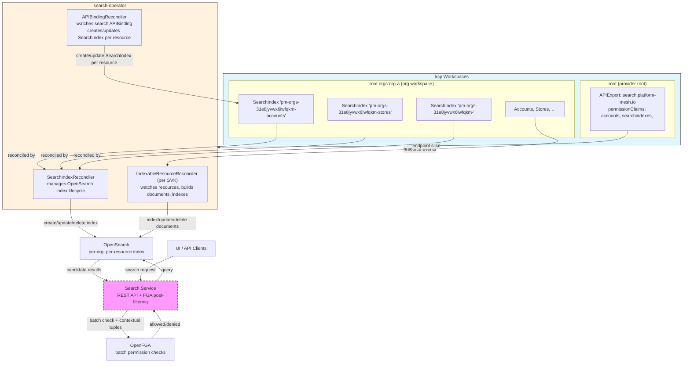

# RFC-003 Search Architecture for Platform Mesh

Status: Implemented
Authors: Platform Mesh Team
Date: 2026-04-20 (updated from 2026-02-17)

## Summary

This RFC describes the search architecture for Platform Mesh that enables full-text search, exact-match filtering, and semantic search across kcp resources with fine-grained authorization using OpenFGA. The architecture exposes search as a kcp provider offering the APIExport `search.platform-mesh.io` and the `SearchIndex` custom resource managed by the `search-operator`. One `SearchIndex` is created per organization per indexed resource type, living in the `root:orgs` workspace. The search-operator watches kcp resources across all workspaces that bind the search export and indexes them into dedicated per-org-per-resource OpenSearch indexes. Default APIBindings ensure that resources can be discovered across workspaces.

## Context and Problem Statement

Platform Mesh did not provide advanced search capabilities (partial word search, fuzzy search, semantic search) across kcp resources. Every consumer has to implement their own search infrastructure and authorization logic. This causes:

- Duplicated effort across teams
- Inconsistent search experiences
- Complex authorization per implementation
- No unified way to discover resources across the platform

## Goals

- Provide a generic, reusable search architecture integrated with Platform Mesh
- Enable per-organization search indexes with proper isolation
- Leverage OpenFGA for fine-grained authorization on search results
- Support declarative, configurable resource tracking
- Expose search through Platform Mesh as a standard provider (APIExport)
- Enable semantic search via configurable per-field vector indexing

## Non-Goals

- Replacing kcp list/watch operations for real-time resource queries
- Search engine pluggability (OpenSearch is the implementation)
- Implementing search UI components (API-only)
- Cross-organization search (hard security boundary)
- Sharding support (as of now)

## Architecture Overview

Search is implemented as a kcp provider using the APIExport model. The `search-operator` binds to the `search.platform-mesh.io` APIExport endpoint slice and operates across all workspaces that have an active APIBinding to this export. No initializer or workspace type modification is required. Resource registration happens through permission claims on the APIExport.



**Note**: [Adr-06](../adr/adr-06-search-implementation.md) mentions a Search Service with FGA post-filtering as one option.

## Components

### 1. APIExport: search.platform-mesh.io

Search is exposed as a kcp provider via an `APIExport` in the provider root workspace (`:root:providers:search`). The export declares:

- The `SearchIndex` `APIResourceSchema` (the only resource type exposed by the provider)
- **Permission claims** for all resource types the operator needs to read across bound workspaces

```yaml
apiVersion: apis.kcp.io/v1alpha1
kind: APIExport
metadata:
  name: search.platform-mesh.io
spec:
  latestResourceSchemas:
    - v<date>.searchindexes.search.platform-mesh.io
  permissionClaims:
    - group: core.platform-mesh.io
      resource: accounts
      all: true
    - group: core.platform-mesh.io
      resource: accountinfos
      all: true
    - group: core.platform-mesh.io
      resource: searchindexes
      all: true
    # additional resource types registered for indexing
```

Workspaces bind to this APIExport to register their resources for indexing. The search-operator discovers all bound workspaces via the APIExport endpoint slice.

### 2. SearchIndex APIResourceSchema

`SearchIndex` (`search.platform-mesh.io/v1alpha1`) is the central configuration object for a search index. It is cluster-scoped and created **per organization per indexed resource type** in the org workspace by the `APIBindingReconciler` when a workspace binds to the search APIExport.

```yaml
apiVersion: search.platform-mesh.io/v1alpha1
kind: SearchIndex
metadata:
  name: pm-orgs-31e8jyvwx6iwfqkm-accounts  # {indexPrefix}-{orgClusterID}-{resourcePlural}
spec:
  organizationClusterID: 31e8jyvwx6iwfqkm  # immutable kcp logical cluster ID
  indexPrefix: pm-orgs
  resource: accounts                        # plural name of the APIResourceSchema

  numberOfReplicas: 1
  numberOfShards: 1              # This refers to OpenSearch shards not kcp sharding!

  paused: false                  # suspend all indexing without deleting the index

  # All fields are searchable by default (full-text).
  # The following configure additional index behavior on top of that:
  filterableFields:              # for exact-match filtering and faceting
    - spec.region
    - status.phase
  semanticFields:                # for ML-based vector similarity search
    - spec.description
  excludedFields:                # fields completely excluded from the search
    - spec.clusterInfo.ca

status:
  indexName: pm-orgs-31e8jyvwx6iwfqkm-accounts
  documentCount: 1482
  lastSyncTime: "2026-04-20T10:00:00Z"
  conditions:
    - type: Ready
      status: "True"
```

#### Field Configuration

All fields present in a resource are indexed for full-text search by default. The `filterableFields` and `semanticFields` are opt-in additions on top of that default:

| Field type | Purpose | Auto-populated | OpenSearch mapping |
|---|---|---|---|
| *(all fields)* | Full-text search across every resource field that is not excluded | Yes, automatically | text |
| `filterableFields` | Exact-match filtering and aggregations (facets) | No, must be configured | `keyword` |
| `semanticFields` | ML-based semantic search over selected text fields | No, must be configured | OpenSearch `semantic` field type backed by the configured ML model |

`semanticFields` are implemented using OpenSearch's `semantic` field type. The search-operator creates explicit semantic mappings for each configured field and supplies the configured `OPENSEARCH_SEMANTIC_MODEL_ID`. OpenSearch then manages the backing semantic metadata and embedding storage internally.

#### Index Naming

```
OpenSearch index name = {indexPrefix}-{orgClusterID}-{resourcePlural}
e.g. pm-orgs-31e8jyvwx6iwfqkm-accounts
```

The org cluster ID is the immutable kcp logical cluster ID, so org renames do not affect indexes or require data migration.

### 3. Three Controllers

#### SearchIndexReconciler

Watches `SearchIndex` resources. For each:
- Creates the OpenSearch index with configured shard/replica settings
- Updates index settings when spec changes
- Creates index aliases
- Handles finalizer-based deletion of the OpenSearch index when the `SearchIndex` is deleted

#### APIBindingReconciler

Watches only the `search.platform-mesh.io` `APIBinding` resource. When it reaches `Bound` phase:

1. Reads all bound `APIResourceSchema` objects to discover the indexed resource types
2. Compares resource types from export with current `SearchIndex` resources in respective org
3. Creates/deletes/updates the affected `SearchIndex` resources in the org workspace

Each `SearchIndex` is named `{indexPrefix}-{orgClusterID}-{resourcePlural}` and targets a single resource type. As new resource schemas are added to the APIExport, new `SearchIndex` resources are created automatically.

#### IndexableResourceReconciler (one per GVK)

One reconciler per configured resource type (e.g., `core.platform-mesh.io/v1alpha1/Account`). Each:

1. Watches the target resource type across all bound workspaces
2. Builds a `ResourceDocument` enriched with org/account context and FGA permission tuples
3. Indexes the document into the matching OpenSearch index (resolved via the `SearchIndex` for that org and resource type)
4. Removes the document from OpenSearch when the resource is deleted

Configured via environment variable:
```
SEARCHABLE_RESOURCE_RESOURCES=core.platform-mesh.io;v1alpha1;Account
```

**Note**: This gives some control in the operator configuration to exclude some indexes of the search exports but blocks dynamic updates. There will be a separate ADR in the future. 

### 4. Document Structure

Each indexed resource is stored as a `ResourceDocument` in OpenSearch:

```
id                  — deterministic: "{clusterID}-{namespace|_cluster}-{kind}-{name}"
kind / name / namespace / api_group / api_version
cluster_name        — kcp logical cluster ID
workspace_path      — full kcp workspace path

organization_id / organization_name
account_id / account_name

fga_object          — OpenFGA object reference, e.g. "core_platform-mesh_io_account:ID/name"
permissions         — []PermissionTuple stored at index time (user, relation, object)

labels / annotations — flat_object
custom_fields       — all resource fields, indexed for full-text search by default

payload_raw_json    — full raw JSON (stored, not indexed; for retrieval)
payload_text        — full text representation (indexed for full-text search)

created_at / updated_at
```

#### Permission Tuples at Index Time

FGA permission tuples are embedded in every document at indexing time, derived from the resource's FGA object and its hierarchy context. This avoids runtime FGA lookups for every candidate result during search.

```go
type PermissionTuple struct {
    User     string  // e.g. "user:alice", "role:admin#assignee"
    Relation string  // e.g. "member", "owner", "viewer"
    Object   string  // matches fga_object of the document
}
```

## Configuration

| Environment Variable | Default | Description |
|---|---|---|
| `KCP_KUBECONFIG` | `/api-kubeconfig/kubeconfig` | Path to kcp kubeconfig |
| `OPENSEARCH_URL` | `https://opensearch.portal.localhost:8443` | OpenSearch endpoint |
| `OPENSEARCH_USERNAME` | `admin` | OpenSearch credentials |
| `OPENSEARCH_PASSWORD` | `admin` | OpenSearch credentials |
| `OPENSEARCH_INDEX_NAME_PREFIX` | `pm-orgs` | Static prefix for all index names |
| `SEARCHABLE_RESOURCE_RESOURCES` | `core.platform-mesh.io;v1alpha1;Account` | Comma-separated GVKs to index |
| `API_EXPORT_ENDPOINT_SLICE_NAME` | `search.platform-mesh.io` | APIExport endpoint slice to watch |

## Implementation Roadmap

### Completed

- `SearchIndex` CRD with spec/status schema, field configuration (filterableFields, semanticFields), paused flag
- Search provider via `search.platform-mesh.io` APIExport with permission claims
- `SearchIndexReconciler` — OpenSearch index lifecycle management
- `APIBindingReconciler` — per-resource SearchIndex auto-provisioning
- `IndexableResourceReconciler` — per-GVK resource watching and document indexing
- FGA permission tuples embedded at index time
- Multicluster-native implementation via `multicluster-runtime` and `multicluster-provider`
- OpenSearch integration with per-org-per-resource indexes, deterministic document IDs

### Planned

1. **Search Service** — REST API with FGA post-filtering, query transformation, result ranking
2. **Semantic search** — configure OpenSearch `semantic` field mappings for selected `semanticFields` and query them with `neural` search using the configured ML model.
3. **Pre-filtering optimization** — add account-level filters to OpenSearch queries to reduce FGA batch check size
4. **Index freshness monitoring** — SLO definition, reconciliation jobs to detect/repair index drift
5. **Production hardening** — auth, OpenSearch persistence, backup/restore, replica configuration

## Open Questions

- What is the target index freshness SLO (time from resource creation to searchability)?
- Should Search be supported cross kcp shards?

## Related Documents

- [ADR-06: Search Implementation in Platform Mesh](../adr/adr-06-search-implementation.md)
- OpenFGA Documentation
- OpenSearch Documentation
- kcp APIExport / Permission Claims Documentation
