# RFC 008: Component Modularity and Replaceability in Platform Mesh

| Status  | Proposed                    |
|---------|-----------------------------|
| Author  | @perseus985                 |
| Created | 2026-04-01                  |
| Updated | 2026-04-09                  |

## Summary

This RFC proposes that Platform Mesh components, specifically the identity provider
(Keycloak), the authorization engine (OpenFGA), and the portal layer (OpenMFP +
GraphQL Gateway) become independently optional and replaceable. Operators should
be able to disable any of these components and substitute an alternative
implementation without forking Platform Mesh or losing core functionality.

## Motivation

Platform Mesh today bundles a specific set of technology choices:

| Concern         | Current implementation    |
|-----------------|---------------------------|
| Identity / OIDC | Keycloak                  |
| Authorization   | OpenFGA (ReBAC)           |
| Portal / UI     | OpenMFP + GraphQL Gateway |
| GitOps          | Flux                      |

These choices are reasonable defaults. However, treating them as hard,
non-negotiable dependencies creates a significant adoption barrier for organizations
that:

- Already operate an enterprise identity provider (e.g. Active Directory Federation
  Services, Okta, Ping Identity etc.)
- Have existing authorization infrastructure they are required to use
- Want to use an alternative portal framework (e.g. Backstage or Headlamp)
- Deploy in environments where some components are operational overload for use cases
  where a UI or other components aren't necessary
- Do not need multiple organizations or nested accounts, and want to reduce
  complexity and resource consumption accordingly
- Require an API-only deployment without any portal components (kcp API only)

Modularity directly reduces the complexity and resource footprint of Platform Mesh
in scenarios where the full feature set is not needed.

The goal of this RFC is not to remove any existing component. It is to ensure that
each component can be **turned off independently** and **replaced with an
alternative** that conforms to a defined interface (e.g. OIDC or GraphQL) so that the Platform Mesh core
remains valuable regardless of the surrounding technology choices.

## Security Rationale

In security-hardened and compliance-heavy environments, fewer running components
means a smaller attack surface.

- **OpenFGA** is called on every kcp API request via webhook. In deployments where
  ReBAC is not required, e.g. single-tenant or environments with existing
  authorization infrastructure, this is unnecessary overhead and an additional
  availability dependency on the critical API path.
- **Keycloak** requires a database, ongoing CVE maintenance, and dedicated
  operational expertise. Organizations already running an enterprise IdP should not
  be required to operate a second one, even when it's only used to sync identities to it.
- **OpenMFP and the GraphQL Gateway** expose additional network endpoints. In
  non-interactive or API-only deployments, these surfaces are unnecessary.

Making components optional is therefore both an operational and a security
improvement.

## Supported Configuration Variants

The following deployment configurations must be supported. Each variant removes
one or more optional components while the remaining stack stays fully functional:

| # | Configuration                         | Description                                      |
|---|---------------------------------------|--------------------------------------------------|
| 1 | w/o OpenFGA                           | No ReBAC; authorization via Kubernetes RBAC       |
| 2 | w/o OpenFGA + Keycloak                | No ReBAC, no managed IdP; external IdP (e.g. Dex) |
| 3 | w/o Keycloak                          | External IdP, OpenFGA still active                |
| 4 | w/o Portal                            | API-only, no UI components                        |
| 5 | w/o Portal + Keycloak                 | API-only with external IdP                        |
| 6 | w/o Portal + OpenFGA                  | API-only, no ReBAC                                |
| 7 | w/o Portal + OpenFGA + Keycloak       | Minimal: API-only, external IdP, Kubernetes RBAC  |

E2E tests must cover each of these configuration variants to ensure functionality
across releases.

### Full Deployment (all components)

```mermaid
graph TD
    User((User))

    subgraph "Layer 3 — Portal & Extensibility"
        Portal[Portal UI / IAM UI]
        GW[GraphQL Gateway]
        ExtMgr[Extension Manager]
    end

    subgraph "Layer 2 — Authorization & Identity Infrastructure"
        KC[Keycloak]
        FGA[OpenFGA]
        ReBACWH[ReBAC AuthZ Webhook]
        IAM[iam-service]
    end

    subgraph "Layer 1 — Core &#40;always required&#41;"
        KCP[kcp]
        PMOp[PM Operator]
        Flux[Flux]
        SecOp[security-operator]
        AccOp[account-operator]
    end

    User --> Portal
    Portal --> GW
    GW --> KCP
    KC -.->|OIDC| KCP
    ReBACWH -->|authz webhook| KCP
    ReBACWH --> FGA
    SecOp --> FGA
    SecOp --> KC
    AccOp --> FGA
    AccOp --> KCP
    IAM --> FGA
    IAM --> KC
    ExtMgr --> KCP
    PMOp --> Flux
    Flux --> KCP
```

### Variant 2: w/o OpenFGA + Keycloak (external IdP, K8s RBAC)

```mermaid
graph TD
    User((User))

    subgraph "Layer 3 — Portal & Extensibility"
        Portal[Portal UI / IAM UI]
        GW[GraphQL Gateway]
        ExtMgr[Extension Manager]
    end

    subgraph "Layer 1 — Core &#40;always required&#41;"
        KCP[kcp]
        PMOp[PM Operator]
        Flux[Flux]
        SecOp[security-operator]
        AccOp[account-operator]
    end

    ExtIdP[External IdP
e.g. Dex]

    User --> Portal
    Portal --> GW
    GW --> KCP
    ExtIdP -.->|OIDC| KCP
    SecOp -->|K8s RBAC| KCP
    AccOp -->|K8s RBAC| KCP
    ExtMgr --> KCP
    PMOp --> Flux
    Flux --> KCP

    style ExtIdP stroke-dasharray: 5 5
```

### Variant 7: w/o Portal + OpenFGA + Keycloak (minimal, API-only)

```mermaid
graph TD
    User((User / API Client))

    subgraph "Layer 1 — Core &#40;always required&#41;"
        KCP[kcp]
        PMOp[PM Operator]
        Flux[Flux]
        SecOp[security-operator]
        AccOp[account-operator]
    end

    ExtIdP[External IdP
e.g. Dex]

    User -->|kcp API| KCP
    ExtIdP -.->|OIDC| KCP
    SecOp -->|K8s RBAC| KCP
    AccOp -->|K8s RBAC| KCP
    PMOp --> Flux
    Flux --> KCP

    style ExtIdP stroke-dasharray: 5 5
```

## Proposal

### Core vs. Optional Components

We propose a layered model for Platform Mesh components, inspired by the
platform's own architectural thinking. Each layer depends on the layers inside
it, but outer layers can be omitted without breaking inner ones.

**Layer 1 — Core (always required):**
- KCP (KCP-API-Server, LogicalCluster-Manager, VirtualWorkspaces)
- Platform Mesh Operator (pm-operator)
- Flux (hard runtime dependency: the Operator creates HelmRelease resources
  and expects Flux controllers to reconcile them) (ArgoCD in Future)
- security-operator (always required; manages OpenFGA stores/models/tuples
  when OpenFGA is active, or Kubernetes RBAC resources when it is not)
- account-operator (always required; manages account lifecycle and
  authorization state in OpenFGA or Kubernetes RBAC depending on
  configuration)

**Layer 2 — Authorization and Identity Infrastructure (optional per component):**
- Keycloak (identity provider)
- OpenFGA (authorization engine)
- rebac-authorization-webhook
- iam-service (user queries, user role assignment tuples; requires either
  OpenFGA or Kubernetes RBAC backend)

**Layer 3 — Portal, Extensibility, API Compositions (optional):**
- OpenMFP Portal + GraphQL Gateway (kubernetes-graphql-gateway)
- virtual-workspaces (provides Virtual Workspace API, required when Portal is enabled)
- extension-manager-operator
- Portal UI, IAM UI
- Marketplace-UI

**Outer layer — Provider-specific components (fully optional):**
- resource-broker

The key requirement is that omitting an outer layer leaves inner layers
fully functional. A deployment with only Layer 1 is minimal but operational.
Adding Layer 2 components enables managed identity and fine-grained
authorization. Adding Layer 3 provides a portal experience on top.

### Single-Organization and Flat Account Mode

When deployed without OpenFGA or in resource-constrained environments, Platform
Mesh should support a **single-organization mode**:

- A predefined organization is provisioned at deployment time
- Creation of additional organizations is disabled
- Account depth is limited to 1 (flat hierarchy, no accounts-in-accounts
  WorkspaceType configuration)

This reduces complexity and resource requirements for scenarios that do not need
multiple organizations or nested account structures, such as API-only deployments
or single-tenant environments.

> **Note:** The account-depth restriction currently only applies at the portal
> level via a feature flag. This RFC requires it to be enforced at the API level
> as well.

### RBAC Fallback When OpenFGA Is Disabled

When OpenFGA is not active, Platform Mesh must manage Kubernetes RBAC resources
as a fallback for roles and permissions. Today the `security-operator`,
`account-operator`, and `iam-service` write authorization tuples to OpenFGA.
Analogously, these operators must create and reconcile the equivalent Kubernetes
RBAC resources (Roles, RoleBindings, ClusterRoles, ClusterRoleBindings) when
OpenFGA is absent.

### Static OIDC Client Configuration

Keycloak currently uses OIDC Dynamic Client Registration (RFC 7591) to
provision OIDC clients per organization. When using an external IdP instead of
Keycloak, operators must be able to define static OIDC client information
(client ID, client secret, issuer URL) directly in the PlatformMesh resource,
as external IdPs typically do not support dynamic client registration.

### OIDC Scope Parameterization

OpenMFP and other components that perform OIDC flows must allow the OIDC scopes
to be configured via the PlatformMesh resource. Different IdPs require different
scopes:

- **Dex** requires the `offline_access` scope to issue refresh tokens
- Additional scopes like `email`, `profile`, or `groups` may be necessary
  depending on the IdP and user account setup

This parameterization must be exposed in the PlatformMesh custom resource.

### Runtime Mutability of Components

It must be possible to add or remove optional components after the initial
deployment. For example, adding the portal layer to an initially API-only
deployment, including all dependent components, should be a supported operation.

Whether full runtime mutability is required at day-1 or can be deferred is an
open question. As a minimum, the initial release must support selecting the
desired configuration variant at install time. Post-deployment changes (adding
or removing components on a running instance) can follow in a subsequent release
once the migration paths described below are validated.

### State Management and Migration Strategy

Each optional component manages different kinds of state. When components are
added to or removed from a running deployment, this state must be created,
migrated, or cleaned up. The following outlines the per-component data
footprint and the migration approach for each.

#### OpenFGA

**Managed state:**
- Per-account FGA stores, each containing an authorization model (type
  definitions and relation configurations)
- Authorization tuples written by three distinct operators:
  - `security-operator`: baseline tuples, store creation, authorization model
    management (tracked via `status.managedAllowExpressions`)
  - `account-operator`: account relationship tuples (parent relations,
    creator→owner role assignments)
  - `iam-service`: user role assignment tuples (written via
    `assignRolesToUsers` / `removeRole` GraphQL mutations)

**Removing OpenFGA (switching to Kubernetes RBAC):**
1. For each account, read the existing OpenFGA tuples and derive equivalent
   Kubernetes RBAC resources (Roles, RoleBindings, ClusterRoles,
   ClusterRoleBindings). This must cover tuples from all three writers:
   `security-operator` (API access policies), `account-operator` (account
   hierarchy and ownership), and `iam-service` (user role assignments).
2. Apply the generated RBAC resources and verify that access decisions match
   the previous OpenFGA state (e.g. by running the E2E authorization tests
   against the RBAC-only configuration).
3. Disable the `rebac-authorization-webhook` in kcp (toggle:
   `values.infra.values.kcp.webhook.enabled`) and remove the OpenFGA
   deployment.
4. Clean up orphaned FGA store references in account specs
   (`Spec.FGA.Store.Id`).

**Adding OpenFGA to an existing RBAC-only deployment:**
1. Deploy OpenFGA and the `rebac-authorization-webhook`.
2. For each account, create an FGA store and seed the authorization model.
3. Translate existing Kubernetes RBAC resources into OpenFGA tuples for all
   three tuple writers (security-operator, account-operator, iam-service).
4. Enable the authorization webhook in kcp and verify access decisions.
5. Optionally remove the now-redundant Kubernetes RBAC resources once the
   webhook is confirmed operational.

**Rollback:** If the migration fails mid-way, the previous authorization
mechanism (RBAC or OpenFGA) remains intact because it is not removed until the
new mechanism is verified. The migration must be designed as a two-phase
process: first apply the new state, then cut over, then clean up the old state.

#### Keycloak

**Managed state:**
- Realms (one per organization, created by the `security-operator`
  IDP subroutine)
- OIDC clients registered via Dynamic Client Registration (RFC 7591),
  with registration access tokens and client secrets stored in Kubernetes
  Secrets
- Service account clients (`security-operator`, `iam-service`) bootstrapped
  via init container with admin realm role
- User identities, group mappings, and invite state
- Workspace authentication configuration per organization
  (`WorkspaceAuthenticationConfiguration`)

**Removing Keycloak (switching to an external IdP):**
1. Configure static OIDC client information in the PlatformMesh resource
   (issuer URL, client ID, client secret) pointing to the external IdP.
   This replaces Keycloak's Dynamic Client Registration which external IdPs
   typically do not support.
2. Ensure the external IdP has equivalent users and group mappings. This is
   an operational prerequisite that must be completed before migration.
3. Update `WorkspaceAuthenticationConfiguration` resources to reference the
   new issuer URL and JWT audiences.
4. Reconfigure kcp to validate tokens from the new issuer.
5. If OpenMFP is active, update its OIDC scope configuration (e.g. add
   `offline_access` for Dex).
6. Remove the Keycloak deployment, its backing PostgreSQL database, and the
   now-unused OIDC client secrets.

**Adding Keycloak to a deployment using an external IdP:**
1. Deploy Keycloak and provision realms and OIDC clients for each existing
   organization.
2. Sync or federate users from the external IdP into Keycloak.
3. Reconfigure kcp and other components to use the Keycloak issuer.
4. Remove the static OIDC client configuration.

**Rollback:** Keep the external IdP configuration intact until Keycloak is
verified. If Keycloak provisioning fails, the static OIDC configuration
continues to work without interruption. Reverse the kcp issuer change to
restore the previous state.

#### Portal Layer (OpenMFP, GraphQL Gateway)

**Managed state:**
- The portal layer is largely stateless. It aggregates ContentConfiguration
  and APIBinding resources stored in kcp (etcd). No external database or
  persistent storage is involved.

**Adding the portal layer:**
1. Deploy OpenMFP, the GraphQL Gateway, and the extension-manager-operator.
2. The portal reads existing kcp resources on startup — no data migration
   is needed.

**Removing the portal layer:**
1. Remove the portal deployments. ContentConfiguration resources remain in
   kcp and are harmless if unused.
2. No data cleanup is strictly required, though orphaned ContentConfiguration
   resources can be removed for hygiene.

**Rollback:** Re-deploy the portal components. Since no state is destroyed
during removal, the portal restores its previous view immediately.

### Defined Interfaces, Not Specific Implementations

For each optional component, Platform Mesh should define an interface that any
conforming implementation can satisfy:

**Identity / OIDC interface:**
- Provide a standards-compliant OIDC discovery endpoint
- Issue JWTs that kcp can validate
- Examples: Keycloak (default), Dex, Okta, Azure AD, ADFS

**Authorization interface:**
- Provide a webhook endpoint compatible with the Kubernetes authorization webhook
  protocol, or fall back to kcp-native RBAC
- Examples: OpenFGA (default), Kubernetes RBAC (no external authorization engine)

**Portal interface:**
- Consume the Platform Mesh API (kcp workspaces, provider APIs) and present them
  to users
- Examples: OpenMFP (default), Backstage via a Platform Mesh plugin, custom portal

**GitOps interface:**
- Reconcile manifests from a source repository into kcp workspaces
- Examples: Flux (default), ArgoCD (https://github.com/platform-mesh/backlog/issues/184)

Defining these interfaces, even informally as documentation, would make it
possible for the community to build and maintain alternative integrations without
modifying Platform Mesh itself.

### Operator Behavior Without Optional Components

The Platform Mesh Operator must handle absent optional components gracefully:

- Controllers that integrate with OpenFGA should check for its presence before
  registering webhook handlers or making authorization calls. If OpenFGA is absent,
  the operators must manage Kubernetes RBAC resources instead (see
  [RBAC Fallback](#rbac-fallback-when-openfga-is-disabled)).
- Controllers that provision Keycloak realms or clients should be skippable via
  configuration. If no identity provider is configured, the operator expects kcp to
  be configured with an external OIDC issuer directly.
- Provider-specific operators that depend on OpenFGA or Keycloak should clearly
  document this dependency and fail with a descriptive error, not a crash, if
  the dependency is absent.

### Packaging and Delivery

The Platform Mesh is delivered as an **OCM (Open Component Model) artifact**.
The existing deployment path remains unchanged: operators configure the
**PlatformMesh custom resource**, the **PlatformMesh-Operator** reconciles it,
and the resulting **Helm values** are consumed via the OCM component.

Component toggles (e.g. `values.keycloak.enabled: false`,
`values.openfga.enabled: false`, `values.portal.enabled: false`) and
configuration overrides (OIDC settings, scope parameterization) must be
expressible through the PlatformMesh resource and propagated as Helm values
to the respective sub-charts.

## Open Questions

1. **Interface definition**  Is there appetite for formally defining the OIDC,
   authorization, and portal interfaces that alternative implementations must
   satisfy? Even informal documentation would be a useful starting point.

2. **RBAC-only mode implementation**  The RBAC fallback when OpenFGA is absent
   is described in this RFC, but the exact implementation is open: is disabling
   the authorization webhook a kcp configuration change, a code change in the
   Platform Mesh Operator, or both?

3. **Day-1 scope for runtime mutability**  Should the first release support
   changing configuration variants on a running deployment, or is install-time
   selection sufficient initially? The migration paths are outlined in
   [State Management and Migration Strategy](#state-management-and-migration-strategy)
   but need validation before being declared production-ready.

4. **OpenFGA store lifecycle**  Per-account FGA stores are referenced via
   `Spec.FGA.Store.Id` but there is no documented backup or export procedure.
   Before enabling OpenFGA removal on running deployments, a store export/import
   mechanism should exist.

5. **Roadmap**  Is component replaceability on the Platform Mesh roadmap?  Are
   there existing architectural decisions that affect feasibility?

## Non-Goals

- Removing Keycloak, OpenFGA, or OpenMFP as defaults, they remain the
  out-of-the-box experience
- Breaking changes to existing Platform Mesh API or CRD schemas (additive changes
  to the PlatformMesh resource for component toggles and OIDC configuration are
  in scope)

### Implementation Support Tiers

Alternative implementations should be classified by their validation level.
The following table captures the initial target state:

| Component   | Tier 1 (Default, fully tested) | Tier 2 (Tested, supported)     | Tier 3 (Community, best-effort)     |
|-------------|-------------------------------|-------------------------------|-------------------------------------|
| Identity    | Keycloak                      | Dex                           | Okta, Azure AD, ADFS, others        |
| Authorization | OpenFGA (ReBAC)             | Kubernetes RBAC (built-in)    | —                                   |
| Portal      | OpenMFP                       | None (API-only)               | Backstage, custom                   |
| GitOps      | Flux                          | —                             | ArgoCD                              |

- **Tier 1:** Default out-of-the-box, covered by full E2E test suite
- **Tier 2:** Actively tested in CI, documented configuration, supported
- **Tier 3:** Known to work or community-contributed, not part of CI

## References

- cert-manager disabling: https://github.com/platform-mesh/platform-mesh-operator/issues/504
- Backstage: https://backstage.io
- Platform Mesh Operator: https://github.com/platform-mesh/platform-mesh-operator
- kcp documentation: https://docs.kcp.io
