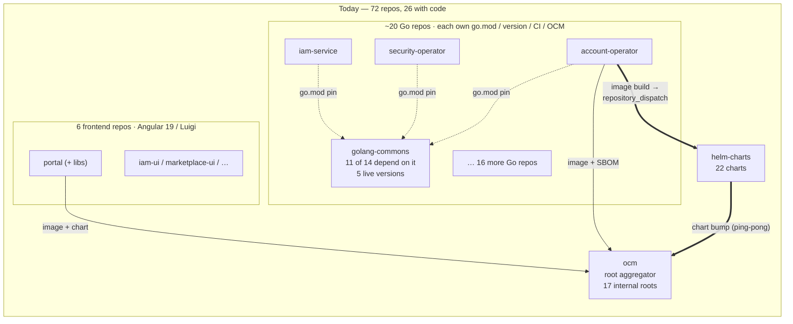
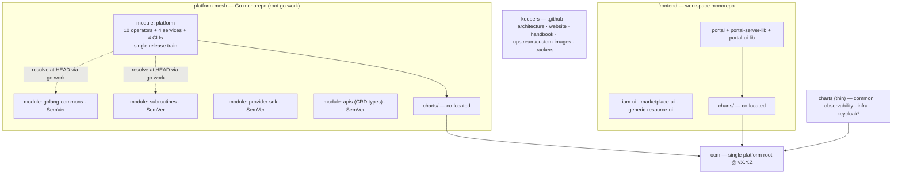
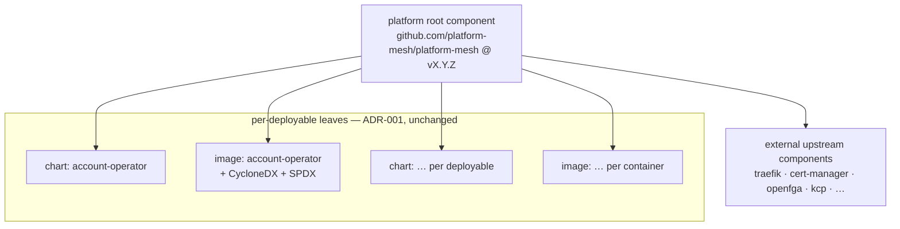
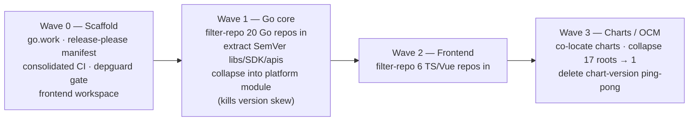

# RFC 009: Platform Mesh Repository Consolidation

| Status  | Proposed    |
|---------|-------------|
| Author  | Mirza Kopic |
| Created | 2026-06-05  |
| Updated | 2026-06-05  |

## Summary

Platform Mesh source code is spread across **72 GitHub repositories**, of which only
**26 hold active first-party code** (20 Go, 6 TypeScript/Vue). The remainder are build
tooling, docs, trackers, examples, and archives. This sprawl now imposes a structural
tax: tight cross-repo dependency chains, a large OCM/Helm release surface, 100–150 open
Renovate PRs at any time, dozens of near-identical CI pipelines, heavy registry traffic,
and a local-development footprint that an 8 GB laptop cannot run.

This RFC proposes consolidating **same-technology** repositories into **two repositories** —
one Go workspace and one frontend workspace — released on a **single platform version
train**, while keeping the handful of Go libraries that external providers import as
independently versioned modules. Charts move next to the code they deploy, eliminating
the cross-repo chart-version "ping-pong". The migration is **phased and history-preserving**;
the long tail of examples and dead repos is handled by [ADR 009](../adr/009-repository-tiers-and-contrib-prefix.md).

Consolidation is the topology and build-and-release foundation. It deliberately does **not**
change runtime composition — that is the subject of [RFC 008](008-platform-mesh-modularization.md),
which is **sequenced after** this work and is **not a dependency** of it.

## Context and Problem Statement

The `platform-mesh` organization was created on 2026-01-10 and has grown to 72 repositories
in roughly sixteen months. Growth-by-repository was the right default early on — it let
independent components ship independently. At the current size the per-repository overhead
dominates, and the coupling between repositories has become the main source of friction.

Concrete, `gh`-verified figures (2026-05-29):

- **Code is only 26 of the 72 repos.** 20 Go (10 operators, 4 services, 2 shared libraries,
  4 CLIs/tools) and 6 frontend (Angular 19 + Luigi micro-frontends + the portal). The other
  46 are build/OCM tooling, docs, the website, governance, trackers, examples/samples (11),
  and archived experiments (14).
- **Organisation rulesets are complex.** 9 very similar rulesets for different repository types.
- **The Go libraries are a coupling bottleneck.** `golang-commons` is imported by **11 of the
  14** Go operators/services — across **five different live versions** (`v0.13.0`, `v0.13.23`,
  `v0.13.24-dev`, `v0.16.11`, `v0.17.1`). `subroutines` repeats the pattern (5 dependents,
  3 versions). Every library change ripples through the org as a wave of version-bump PRs, and
  contributors routinely build against stale, mismatched library versions.
- **The release surface is large.** The OCM root descriptor
  `github.com/platform-mesh/platform-mesh` references **17 internal deployable components**
  (plus ~11 external upstream components). Per [ADR 001](../adr/001-sbom-generation-and-ocm-component-restructuring.md)
  each internal deployable fans out into its own *root + chart + image* components, so the real
  component graph is considerably larger than the descriptor's reference list.
- **22 Helm charts** live in a separate `helm-charts` repo (5 CRD-only, a `common` library
  chart, 16 application charts). An image build in a source repo triggers a cross-repo
  `repository_dispatch` (`job-chart-version-update`) into `helm-charts` to bump the chart — a
  "ping-pong" that couples every code change to a second repository.
- **Renovate volume is high.** ~141 PRs open org-wide right now (public repos only; the true
  figure is higher), an estimated 170–250 PRs/month, dominated by Go-module and npm updates
  across the 16 `go.mod` + 8 `package.json` files, plus chart/OCM version pins.
- **Renovate stability days causes additional CI pressure.** The stability days keep PRs open for weeks with no intent on merging them, with Renovate continuously updating the PR and rerunning CI.
- **CI is duplicated.** 24 shared workflows in the org `.github` repo, plus ~4 per-repo
  workflows × ~24 code repos ≈ 80+ per-repo workflow files to keep in sync
  (per [ADR 004](../adr/004-shared-ci-workflow-strategy.md)).
- **Registry traffic is heavy.** ~1.22 billion lifetime OCM pulls on the platform-mesh
  descriptor; the current line is build 406 of `0.4.0`, with recent builds pulling
  1,300–3,000+ times each within hours of publishing. Each per-component release re-resolves
  and re-pulls a multi-root component tree.
- **Local development does not fit an 8 GB laptop.** Cloning, building, and running the stack
  spans dozens of repositories and images; the resource budget is out of reach for the
  machines many external contributors actually have.

## Goals

1. **Simpler external-developer DX** and lower onboarding cognitive load — one obvious place
   to read, build, and contribute per technology.
2. **Reduce CI/CD complexity** — far fewer pipelines to maintain.
3. **Drastically reduce Renovate PRs count and its associated cost**
4. **Reduce cross-component interdependency.**
5. **Enable rapid local development** — the full stack should be bring-up-able on an 8 GB laptop
   (treated as a binding success criterion, met by consolidation's own mechanisms).
6. **Fast pre-merge test feedback** and local testing that surfaces breakages before merge.
7. **Simplify Helm**. The deployment happens through layers of Helm charts, which adds resource consumption for the deployer (FluxCD) and complexity. The platform-mesh-operator should deploy required resources directly instead of deploying helm charts that deploy resources, as common in the kube landscape.
8. **Fewer PRs to land one feature; fewer repos overall; less registry traffic.**
9. **Separate where it makes sense.** - if a component or group of components is better developed in its own repo it should be moved to its own repo.
10. **Better versioning structure and testability.**
11. **Easier to work with AI across the codebase** — one repository the model can reason over.
12. **Stretch (deferred):** a single Platform Mesh binary, *or* a Tilt-based local setup. This
    RFC enables but does not decide it.

## Non-Goals

- **Runtime composition / replaceability.** Turning components on/off and substituting
  alternatives is [RFC 008](008-platform-mesh-modularization.md). This RFC is about repo,
  build, and release topology only. The two are orthogonal: repository topology is not runtime
  topology.
- **A single polyglot repository.** Go and TypeScript are split into two repos, not merged into
  one (see Alternatives).
- **Deciding the single-binary or Tilt mechanism.** Named as a follow-on goal, not specified here.
- **Changing the OCM 3-component model.** [ADR 001](../adr/001-sbom-generation-and-ocm-component-restructuring.md)
  (root + chart + image, SBOM per image) is preserved verbatim.
- **A migration runbook.** This RFC sets the strategy and the target; the per-repo mechanics
  (filter-repo invocations, CI YAML) are execution detail produced during the migration.

## Proposal: Target Topology

Two technology monorepos hold all first-party code; a small, stable set of repositories is kept
as-is; the long tail is archived or moved to `contrib-` per [ADR 009](../adr/009-repository-tiers-and-contrib-prefix.md).

**Repository disposition (all 72 repos):**

| Disposition | Count | What |
|---|---:|---|
| Merge → Go monorepo | 20 | 10 operators, 4 services, `golang-commons`, `subroutines`, 4 CLIs/tools |
| Merge → frontend monorepo | 6 | `portal`, `portal-server-lib`, `portal-ui-lib`, `iam-ui`, `marketplace-ui`, `generic-resource-ui` |
| Keep standalone | ~21 | `.github`, `architecture`, `platform-mesh.github.io`, `handbook`, `ocm`, `helm-charts`(thinned), `upstream-images`, `custom-images`, `community`, trackers/admin, plus already-archived placeholders |
| Move to `contrib-` | 11 | examples, samples, live POCs (per ADR 009) |
| Archive | 14 | dead POCs, superseded demos/samples |

**Headline:** **26 active code repos → 2.** Counting everything, ~55 active repos drop to
roughly 12–15 maintained repos, with the example/POC long tail consolidated under `contrib-`
or archived.

### What goes where, and edge cases

- **Go operators, services, and CLIs** collapse into a single internal Go module, `platform`,
  laid out as `operators/<name>/`, `services/<name>/`, `cmd/<tool>/`, `libs/<lib>`. Inside one module there
  are no intra-module version pins — packages simply import packages. This is the single
  highest-leverage change in the proposal: it eliminates the `golang-commons` version skew
  outright.
- **Externally consumed libraries** — `golang-commons`, `subroutines`, a `provider-sdk`, and
  the CRD `apis/` types that external providers bind against — are **sibling modules** at the
  repo root, each with its own `go.mod` and independent SemVer. `extension-manager-operator`
  already ships an `api/` submodule consumed by `virtual-workspaces`; this generalizes that
  proven pattern.
- **Frontend** consolidates into one workspace (pnpm/npm workspaces or Nx — see Open Questions).
  Note the portal does **not** import the `*-ui` micro-frontends; they integrate at runtime via
  Luigi. Consolidation co-locates them for shared tooling and atomic changes, not to introduce
  build-time coupling that does not exist today.
- **`kube-bind-provider`** is Go-primary with a small TypeScript UI subdirectory; it lands in
  the Go monorepo, its UI bundled with it (or split to the frontend repo during migration if it
  proves cleaner).
- **Module-path quirks** to fix on the way in: `gardener-syncer` currently declares
  `github.com/kcp-dev/kcp/gardener`; `jl` declares `github.com/openmfp/jl`. These become
  `github.com/platform-mesh/platform/...` paths with redirects.

## Release and Versioning Model

This is the decision that determines how far the OCM, Helm, and Renovate goals actually move.
Two independent expert reviews (a Go-module review and a release-engineering/supply-chain review)
converged on the **same model**, described below from both angles.

**Decision: a hybrid model.**

- The 18 image-producing deployables (10 operators + 4 services + the 3 UI apps, plus CLIs)
  ship on a **single platform release train**: one version `vX.Y.Z` tags the monorepo, and every
  co-located image and chart is built and published at that version in one atomic pipeline run.
- The Go libraries imported by **external** providers (`golang-commons`, `subroutines`,
  `provider-sdk`, and the CRD `apis/` types) keep **independent SemVer** on their own module
  paths, tagged `<module>/vX.Y.Z`.

### Why hybrid, not a pure single train

A pure single train (libraries on the train too) was considered and is the documented
Alternative. It is **rejected** because Platform Mesh has external consumers: third-party
providers `go get` these libraries. On a single train, `golang-commons` would jump to, say,
`v2.5.0` because an unrelated operator shipped a feature — a version number that is meaningless
to a downstream importer and that destroys breaking-change signalling. Version skew is an
*internal* problem (fixed by everyone building against one source of truth — see `go.work`
below); SemVer is an *external contract* problem. The hybrid keeps them separate.

Crucially, the carve-out is **free**: a pure Go library produces **no image and no chart, and
therefore no OCM component at all** (verified against `ocm/constructor/service-component.yaml`,
whose image reference is guarded by `{{- if ne .APP_VERSION "0.0.0" }}`). Independent SemVer for
libraries is an OCM no-op — it costs nothing on the release/supply-chain side.

### What actually happens to OCM component count (honest accounting)

Component count is governed by [ADR 001](../adr/001-sbom-generation-and-ocm-component-restructuring.md)
— one image (+ CycloneDX + SPDX SBOMs) per container, one chart per deployable — **not** by
repository topology. Consolidation does **not** collapse leaf image or chart components, and any
claim of "one OCM component" would be wrong.

What consolidation *does* collapse is the **per-deployable root fan-out**. Today ADR 001 produces
a root component *per software component* (`github.com/platform-mesh/security-operator`,
`.../account-operator`, …) — 17 of them, each referencing its own chart and image. Post-
consolidation, a **single platform root** references every deployable's chart and image
components at one shared version, and the separate aggregation step disappears (the root *is* the
aggregate).

| Component layer | Today | After consolidation |
|---|---|---|
| Platform root / aggregator | 1 aggregator + 17 per-component roots | **1 platform root** |
| External upstream components | ~11–12 | ~11–12 (unchanged — upstream) |
| Chart components (one per deployable) | ~16 app + 5 CRD | ~16 app + 5 CRD (unchanged) |
| Image components (one per container) | ~14+ (terminal-controller-manager = 2) | ~14+ (unchanged) |
| SBOM resources | 2 per image | 2 per image (unchanged) |

So the win is **structural, not numeric**: ~17 internal root components become **one**, the
aggregator step folds into it, and the system moves on **one version axis instead of 17**.
Dropping example/POC deployables (e.g. `example-httpbin-operator`, currently in the production
descriptor) trims further.

### Go mechanics (for implementers)

- If needed, **Commit a root `go.work`.** It makes every module resolve its siblings to **local HEAD**   during development and monorepo CI, regardless of `go.mod` `require` versions. This is the entire skew fix, and it is free. `go.work` is never downloaded by `go get`, so internal "resolve at HEAD" and external "resolve at tagged version" coexist cleanly.
- **Published modules carry no `replace` directives** and never depend on the workspace. A committed `replace` in a published `go.mod` breaks downstream `go get`. CI must build each public module standalone with `GOWORK=off` to prove its tagged dependency graph compiles for external consumers.
- **Do not use `internal` packages**, instead rely on putting code for external consumers into an apimachinery and sdk package
- **Major versions (v2+)** follow Go's import-compatibility rule: the module path gains a `/v2` suffix. Plan for it; external providers will pin majors.
- **Tags are the release contract.** A submodule is released by a tag of the form `<subdir>/vX.Y.Z` (e.g. `golang-commons/v0.18.0`); a bare repo-root tag does not version a submodule.

### Release tooling

Use **release-please in manifest mode**. Each released unit is a component with its own tag
prefix: the `platform` train (`platform/vX.Y.Z`), and one per public library
(`golang-commons/vX.Y.Z`, …). The release-please tag *is* the Go submodule tag — no separate
tagging step. Conventional-commit scopes drive independent bumps. For the CLIs, GoReleaser can
run *downstream* of release-please to produce cross-platform binaries; release-please remains the
version authority.

### Chart co-location

Charts move next to the code they deploy:

- 16 application charts + 5 CRD charts → the Go monorepo (`charts/<name>/`, `charts/<name>-crds/`)
  and the frontend monorepo (the 3 UI charts), respectively.
- `common` (library chart), `observability` (pure aggregation of 3 external sub-charts), `infra`,
  and the `keycloak`/`keycloak-operator` upstream-rebuild charts stay in a thinned `helm-charts`
  repo (rename to `charts`/`platform-charts`).

Co-location changes the **trigger, not the model**. OCM component names are path-based and
decoupled from the git repo ([ADR 001](../adr/001-sbom-generation-and-ocm-component-restructuring.md)),
so moving a chart's *source* into the monorepo does **not** rename its OCM component, and
downstream `componentReference` pins keep resolving. The cross-repo `job-chart-version-update`
`repository_dispatch` is **deleted**: the chart's `version`/`appVersion` is stamped in the same
repo and commit as the image build. SBOM and image components are produced by the same image
pipeline (now running inside the monorepo) and are completely unaffected.

## Consequences: OCM / Helm / Renovate / CI

- **OCM:** 17 internal roots → 1 platform root; the aggregator step disappears; one version axis;
  leaf image/chart components and SBOMs preserved exactly (ADR 001 intact).
- **Helm:** the chart-version ping-pong is eliminated; charts and code change atomically; the
  `helm-charts` repo shrinks to cross-cutting and external charts.
- **Renovate:** internal `go.mod`, npm, and chart/OCM version pins **vanish** (one `go.work`
  workspace + one npm workspace; versions are stamped, not pinned cross-repo). External
  dependencies are managed **once** at each workspace root instead of N times across N repos.
  Realistic target: **60–80% fewer** Renovate PRs, the residual being genuine external upgrades.
- **CI:** per-repo pipelines drop from ~24 sets to 2, keeping the [ADR 004](../adr/004-shared-ci-workflow-strategy.md)
  model (per-repo orchestration calling shared `job-*` building blocks). Selective, affected-only
  testing (below) keeps the big repos fast.
- **Registry traffic:** one platform-version bump replaces 17 per-component bumps; the aggregator
  no longer re-resolves and re-pulls a 17-root tree on every component change; unchanged images
  dedup by digest. Per-release and per-month OCM/GHCR pull volume should drop sharply.

## Local-Development Resource Budget

An 8 GB laptop bringing up the full stack is a **binding success criterion**, met by
consolidation's own mechanics, independent of RFC 008:

- **One `git clone`** of the Go monorepo (plus one of the frontend) instead of 26 clones.
- **One build / one bring-up command** per workspace; `go.work` builds everything at HEAD.
- **Fewer images to pull and fewer processes to run** locally, because a single train produces a
  coherent, co-versioned set rather than a matrix of independently-versioned components.

Further footprint reduction — turning components off entirely, swapping heavy dependencies — is
**RFC 008's** territory and is **complementary, not required**. Consolidation must land first and
stand on its own; the single-binary or Tilt-based local setup is a follow-on this work enables.

## Migration Strategy

Phased in waves, **history-preserving** via `git-filter-repo`, with GitHub redirects on archived
source repos so old URLs and `go get` paths keep working. The example/POC long tail is archived
or moved to `contrib-` per [ADR 009](../adr/009-repository-tiers-and-contrib-prefix.md) throughout.

- **Wave 0 — Scaffold.** Stand up the empty Go monorepo (root `go.work`, release-please manifest,
  consolidated CI, the internal→public import gate) and the frontend workspace.
- **Wave 1 — Go core.** Filter-repo the 20 Go repos in, preserving history; extract
  `golang-commons`, `subroutines`, `provider-sdk`, and `apis` as their own SemVer modules;
  collapse operators, services, and CLIs into the internal `platform` module. The five-version
  skew is gone the moment this lands.
- **Wave 2 — Frontend.** Filter-repo the 6 frontend repos into the workspace.
- **Wave 3 — Charts / OCM.** Co-locate charts; collapse the 17 internal roots into one platform
  root; replace `job-chart-version-update` with an in-repo version stamp.
- **Throughout.** Archive the 14 dead repos; move the 11 examples/samples/POCs to `contrib-`.

The Go side becomes a single internal module, so its parts ultimately land together — Wave 1 is
the one decisive step. Within a wave, repos can still be brought in one at a time as
history-preserving subtree merges, keeping the workspace compiling at each step.

## Relationship to Other Records

- **[ADR 001](../adr/001-sbom-generation-and-ocm-component-restructuring.md) (OCM 3-component model)** —
  preserved verbatim. Consolidation collapses roots and removes a cross-repo trigger; it does not
  change component shapes, names, or SBOMs.
- **[ADR 004](../adr/004-shared-ci-workflow-strategy.md) (shared CI strategy)** — preserved.
  Per-repo orchestration calling shared `job-*` building blocks; there are simply two repos
  instead of ~24.
- **[ADR 009](../adr/009-repository-tiers-and-contrib-prefix.md) (repo tiers / `contrib-`)** —
  sibling decision. ADR 009 tiers and labels repos (supported vs `contrib-`, public-by-default)
  and owns the examples/POC long tail; this RFC consolidates the supported Tier-1 code. They
  compose: the consolidated monorepos are Tier-1; the long tail is `contrib-` or archived.
- **[RFC 006](006_provider-bootstrap-operator.md) (provider bootstrap)** — the provider model is
  why a stable, independently-versioned `provider-sdk` and CRD `apis` matter; the hybrid release
  model protects external provider authors.
- **[RFC 008](008-platform-mesh-modularization.md) (configurability / modularity)** — sequenced
  **after** this RFC and **not a dependency**. Repo topology and runtime composition are
  orthogonal; consolidation must not, and does not, require any modularity decision.

## Success Metrics

Acceptance criteria the TSC can check against (baselines `gh`-verified 2026-05-29):

- **Structural:** 26 active code repos → 2; ~55 active repos → ~12–15; open Renovate PRs 141 →
  < 40 (60–80% reduction); internal OCM root components 17 → 1; per-repo CI workflow files 80+ →
  a handful per monorepo.
- **Local development & onboarding:** the full stack bringing up on an 8 GB laptop (pass/fail;
  impossible today); 1 clone + 1 command vs 26 clones; cold-onboard time-to-running-stack tracked.
- **Velocity & feedback:** one atomic PR to land a code + chart + OCM change (vs N cross-repo PRs
  today); pre-merge test feedback under a target (e.g. < 10 minutes) via affected-only CI.
- **OCM / Helm ping-pong:** the cross-repo `job-chart-version-update` dispatch eliminated (count
  → 0).
- **Registry traffic:** OCM/GHCR pull volume per release and per month sharply reduced (one
  platform-version bump replaces 17; no 17-root re-resolution per change; digest dedup).
- **Contributor & consumer stability:** published-library SemVer preserved; old repo URLs and Go
  import paths redirect; downstream `go get` and OCM `componentReference` pins stay resolvable
  through the migration; one obvious place to contribute per technology.

## Pros and Cons

**Pros**

- Eliminates the `golang-commons`/`subroutines` version skew at the source (HEAD resolution).
- Large, measurable reductions in Renovate volume, CI duplication, OCM root fan-out, and registry
  traffic.
- Atomic code + chart + OCM changes; one PR lands a feature.
- One repository per technology for humans and AI to reason over; lower onboarding load.
- Makes the 8 GB local-dev target reachable, and sets up the single-binary/Tilt follow-on.
- Preserves ADR 001/004 and the external-provider SemVer contract.

**Cons**

- **Single-train blast radius:** a bad commit can block the platform release. *Mitigation:*
  affected-only CI on PRs; the full train runs only on the release tag, so a red component blocks
  the tag, not every PR.
- **Version churn:** every component's chart/image is re-stamped each release even if unchanged.
  *Mitigation:* intentional and reproducible (ADR 001 already accepts "every image change → new
  chart release"); registry digest dedup keeps storage flat; optionally re-tag rather than rebuild
  byte-identical images.
- **Partial/hotfix releases** are less trivial than fully independent versioning. *Mitigation:*
  OCM multi-version support is already designed in (ADR 001); a patch train can rebuild only the
  fixed component and re-stamp the rest to the same digest.
- **Large one-time migration** (Wave 1 especially), with a transition window where some consumers
  must update import paths. *Mitigation:* history-preserving filter-repo, GitHub redirects, and a
  documented deprecation window for any externally-referenced per-component OCM roots.
- **Two versioning modes to document** (train vs SemVer libraries). *Mitigation:* a clear, small
  list of which modules are externally consumed.

## Alternatives Considered

1. **Pure single release train** (libraries on the train too). Simpler — one version everywhere —
   but breaks the external `go get` SemVer contract and blocks providers, for no OCM benefit
   (libraries emit no components anyway). Rejected; valid only if no module is externally imported.
2. **A few Go cluster-repos** (e.g. an IAM/account cluster + leaf operators + the shared libs,
   keeping the 7 zero-dependency standalones separate). More conservative and preserves existing
   isolation, but leaves multiple `go.mod`/Renovate surfaces and partial coupling, and weakens the
   "one repo for AI / drastically fewer PRs" goals. Rejected in favor of one Go monorepo.
3. **Single polyglot monorepo** (Go + TS + charts in one repo, Nx/Turborepo/Bazel-style). Maximum
   consolidation but mixes toolchains, adds heavy build tooling, and is the hardest migration.
   Rejected (Non-Goal).
4. **Status quo / keep charts in a separate repo.** Lowest risk, but keeps the chart↔code
   ping-pong, per-module Renovate streams, and the full OCM root fan-out — it barely moves the
   stated goals. Rejected.

## Open Questions

1. **Which Go modules are actually imported by external providers?** This sets the exact carve-out
   set for independent SemVer. If none are, the model degenerates to a pure single train.
2. **Does anything downstream pin the per-component *root* OCM names** (`github.com/platform-mesh/<component>`)
   rather than the chart/image leaf names? This determines whether thin alias roots are needed and
   for how long (deprecation window).
3. **Exact image count** (e.g. `terminal-controller-manager` ships 2 images) — needed to finalize
   the image-component floor.
4. **Frontend workspace tool** — pnpm/npm workspaces vs Nx vs Turborepo. Deferred to a follow-on
   decision during Wave 2.
5. **Repository names** for the two monorepos (e.g. `platform-mesh` vs `platform-mesh-go`) and the
   thinned charts repo — to confirm with the TSC.

## References

- [ADR 001: SBOM Generation and OCM Component Restructuring](../adr/001-sbom-generation-and-ocm-component-restructuring.md)
- [ADR 004: Shared CI Workflow Strategy](../adr/004-shared-ci-workflow-strategy.md)
- [ADR 009: Repository Tiers and `contrib-` Prefix](../adr/009-repository-tiers-and-contrib-prefix.md)
- [RFC 006: Provider Bootstrap Operator](006_provider-bootstrap-operator.md)
- [RFC 008: Component Modularity and Replaceability](008-platform-mesh-modularization.md)
- [Open Component Model](https://ocm.software)
- [Go Modules Reference — module paths, versions, workspaces](https://go.dev/ref/mod)
- [release-please — manifest (monorepo) mode](https://github.com/googleapis/release-please)
