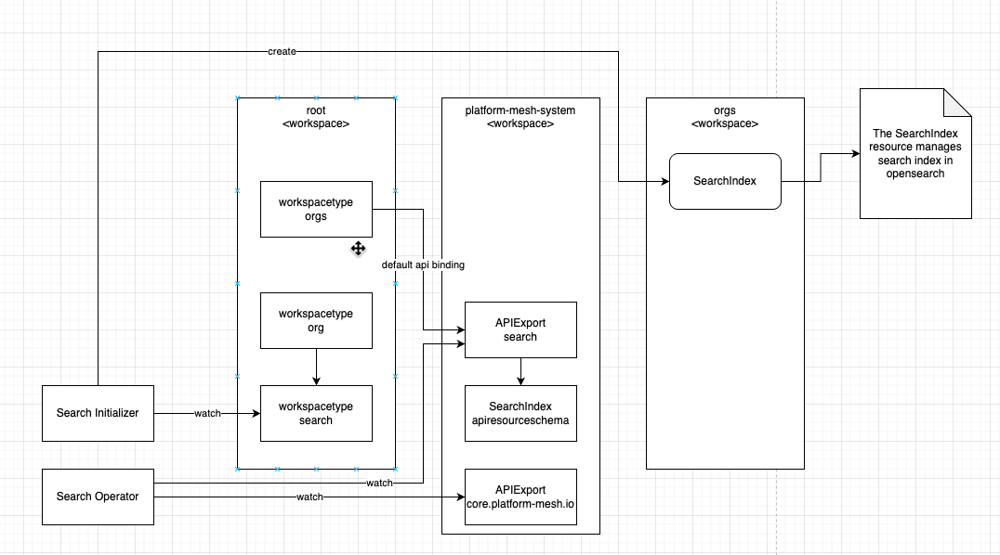
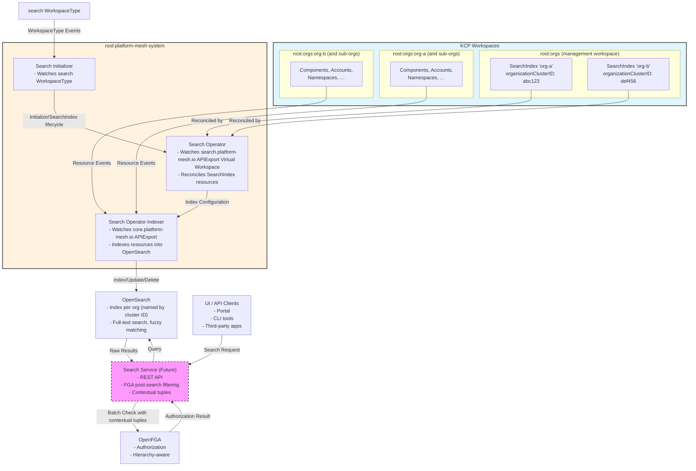

# RFC-001 Search Architecture for Platform Mesh

Status: Draft
Authors: Platform Mesh Team
Date: 2026-02-17

## Summary

This RFC proposes a generic search engine architecture for Platform Mesh that enables advanced searching capabilities (partial word search, fuzzy search, semantic search) across KCP resources with fine-grained authorization using OpenFGA. The architecture introduces a `SearchIndex` APIResourceSchema and a search operator that integrates with OpenSearch to provide per-organization search indexes and handles indexing of various APIResources. One `SearchIndex` resource is created per organization, all residing in the `root:orgs` workspace, which acts as the single management point for org-level search configuration.

## Context and Problem Statement

Currently Platform Mesh does not enable advanced searching such as partial word searches, fuzzy search, or semantic search. Every user must implement their own search architecture and permission management within the search and search index. This leads to:

- Duplicated effort across teams implementing search
- Inconsistent search experiences
- Complex authorization logic per implementation
- No unified way to discover resources across the platform



### Current State

Platform Mesh provides a KRM-based API surface through KCP, but lacks built-in search capabilities beyond basic Kubernetes list/watch operations. Users requiring advanced search must:

1. Deploy their own search infrastructure
2. Implement custom indexing logic
3. Manage search authorization separately from KCP/OpenFGA
4. Maintain synchronization between KCP resources and search indexes

## Goals

- Provide a generic, reusable search architecture integrated with Platform Mesh
- Enable per-organization search indexes with proper isolation
- Leverage OpenFGA for fine-grained authorization on search results
- Support configurable resource tracking (declarative indexing)
- Expose search through Platform Mesh as a standard API resource
- Enable future extensibility (AI-powered search, semantic search)

## Non-Goals

- Replacing KCP list/watch operations for real-time resource queries
- Providing search engine selection/pluggability (OpenSearch is the reference implementation)
- Supporting non-Kubernetes resource indexing in initial version
- Implementing search UI components (API-only)
- Supporting cross-organization search (security boundary)

## Approach

### Architecture Overview

The search architecture consists of six main components:

1. **SearchIndex APIResourceSchema**: Declares what index is used per organization
2. **Search Initializer**: Watches the `search` WorkspaceType and initializes `SearchIndex` resources
3. **Search Operator**: Watches the `search.platform-mesh.io` APIExport Virtual Workspace (`SearchIndex` resources)
4. **Search Operator Indexer**: Watches the `core.platform-mesh.io` APIExport and performs indexing
5. **OpenSearch**: Backend search engine storing indexed documents
6. **Authorization Layer**: OpenFGA integration for filtering search results

**Architecture Diagram**:



**Component Interaction Flow**:

1. **Indexing Phase** (handled by Search Initializer + Search Operator + Search Operator Indexer):
   - Search Initializer watches the `search` WorkspaceType
   - Search Operator reconciles `SearchIndex` resources from the `search.platform-mesh.io` APIExport Virtual Workspace
   - Search Operator Indexer watches `core.platform-mesh.io` resources across workspaces
   - Transforms resources into search documents
   - Indexes them into per-organization OpenSearch indexes
   - This happens continuously as resources are created/updated/deleted

2. **Search Phase** (handled by Search Service):
   - Users send search queries via Search Service (or directly to OpenSearch in POC)
   - Search Service queries OpenSearch and retrieves matching results
   - Results are filtered via OpenFGA batch checks with contextual tuples
   - Only authorized results are returned to the user

3. **Authorization**: Each search result is validated against FGA with hierarchy information (account, namespace) passed as contextual tuples

**Note**: Indexing and searching are completely separate concerns. The Search Initializer, Search Operator, and Search Operator Indexer together handle indexing operations, while the Search Service is only responsible for querying and authorization. In Phase 1 (POC), UIs/clients may query OpenSearch directly. The Search Service as a dedicated component is planned to provide a unified REST API, proper FGA integration, and additional features like query transformation and result ranking.

### SearchIndex Resource Schema

All `SearchIndex` resources live in the `root:orgs` workspace (one per organization). This workspace already acts as the management plane for org-level governance resources (WorkspaceTypes, etc.) and is a natural home for search configuration. The search operator, running in `root:platform-mesh-system`, watches `root:orgs` for `SearchIndex` resources and uses the KCP virtual workspace wildcard endpoint to index resources across each org's workspace tree.

The `SearchIndex` API is exposed through a dedicated `search.platform-mesh.io` APIExport. A single `APIBinding` to this export is provisioned in `root:orgs` by the platform-mesh-operator as part of infrastructure setup. This means that no org-specific `APIBinding` is required.

**API Group**: `search.platform-mesh.io`
**Kind**: `SearchIndex`
**Scope**: Cluster
**Location**: All instances live in `root:orgs`

The `SearchIndex` resource name is the human-readable organization name (e.g., `org-a`). The `spec.organizationClusterID` field holds the immutable KCP logical cluster ID of the top-level org workspace. This cluster ID is used as the OpenSearch index name, making the index rename-safe.

```yaml
apiVersion: search.platform-mesh.io/v1alpha1
kind: SearchIndex
metadata:
  name: org-a                  # human-readable org name; lives in root:orgs
spec:
  organizationClusterID: abc123  # immutable KCP cluster ID; used as OpenSearch index name
  indexPrefix: "pm-orgs"
  numberOfReplicas: 1
  numberOfShards: 1
status:
  indexName: abc123              # OpenSearch index name (equals organizationClusterID)
  documentCount: 1482
  lastSyncTime: "2026-02-17T10:00:00Z"
  conditions:
    - type: Ready
      status: "True"
```

### Workspace Integration

#### APIBinding in `root:orgs`

Because all `SearchIndex` resources live in `root:orgs`, only a single `APIBinding` is needed in `root:orgs` itself. This is provisioned once by the platform-mesh-operator as part of infrastructure setup, not per individual org.

```yaml
apiVersion: apis.kcp.io/v1alpha2
kind: APIBinding
metadata:
  name: search.platform-mesh.io
  # applied in root:orgs
spec:
  reference:
    export:
      path: root:platform-mesh-system
      name: search.platform-mesh.io
  permissionClaims:
    - group: search.platform-mesh.io
      resource: searchindexes
      state: Accepted
```

The org workspace onboarding path must include the search initializer. This can be done by targeting the org workspace type directly or by using an extension workspace type that carries the initializer.

#### Initializer Registration

Modify workspace type `workspace-type-org.yaml` in the platform mesh operator:
```diff
    with:
    - name: security
      path: root
+   - name: search
+     path: root
  defaultAPIBindings:
    - export: core.platform-mesh.io
      path: root:platform-mesh-system
```

```yaml
apiVersion: tenancy.kcp.io/v1alpha1
kind: WorkspaceType
metadata:
  name: search
  annotations:
    kcp.io/cluster: root
    kcp.io/path: root
spec:
  defaultAPIBindings: []
  defaultChildWorkspaceType:
    name: search
    path: root
  initializer: true
```

The search initializer must be attached with its own workspace type that extends the orgs workspace type. Thus, for every initialization of an org the search initializer will be invoked.

#### Automatic Initialization (Initializer Pattern)

SearchIndex provisioning is performed by a dedicated initializer flow (same pattern as security-operator), not by a generic Workspace watch.

The search operator runs an initializer controller that reconciles `LogicalCluster` resources for newly created org workspaces and creates/updates a corresponding `SearchIndex` in `root:orgs`.

Sequence for a new org workspace `org-a`:

1. Platform Mesh creates `root:orgs:org-a` (type `org` or extending `org`).
2. KCP marks the workspace as initializing for the configured search initializer.
3. The search initializer reconciles the workspace `LogicalCluster`.
4. The initializer resolves the **top-level org workspace** and its logical cluster ID (organization cluster ID). For `root:orgs:org-a:*` descendants, this must resolve to `root:orgs:org-a` (not the child workspace cluster ID).
5. The initializer creates/updates `SearchIndex` `org-a` in `root:orgs` with `spec.organizationClusterID` set to that resolved org cluster ID.
6. `SearchIndexReconciler` creates the OpenSearch index.
7. The initializer removes its initializer entry from `LogicalCluster.status.initializers`.

`SearchIndex.spec.organizationClusterID` is the source of truth used by indexing/search components. Child workspaces in an org tree (`root:orgs:org-a:sub-account`, etc.) must map to the same top-level org cluster ID.

When an org workspace is deleted, cleanup should follow the KCP termination path (terminator pattern, the counterpart to initializer), not only generic finalizer handling. The same controller should implement both initializer and terminator responsibilities:
- Initializer: provision/update `SearchIndex` for a new org workspace.
- Terminator: delete the org `SearchIndex` and trigger OpenSearch index cleanup during workspace termination.

**Operator permissions required in `root:orgs` and initializer/terminator scope**:
- `get`/`list`/`watch` on `core.kcp.io/logicalclusters`
- `patch` on `core.kcp.io/logicalclusters/status` (to clear initializer state and complete termination state transitions)
- `get`/`list`/`watch` on `tenancy.kcp.io/workspaces` (for resolving cluster metadata)
- `create`/`update`/`delete` on `search.platform-mesh.io/searchindexes`
- `get`/`update`/`patch` on `search.platform-mesh.io/searchindexes/finalizers` (if `SearchIndex` finalizers are used for OpenSearch cleanup guarantees)

### Search Operator

The search operator is responsible for:

1. **Resource Indexing**: Index resources from defined APIExports
2. **Watch Management**: Establish watches on tracked resources
3. **Document Indexing**: Transform KRM resources to search documents
4. **Index Lifecycle**: Create, update, delete OpenSearch indexes
5. **Status Management**: Update SearchIndex status conditions

**Operator Behavior**:

|Name|Purpose|watches|modifies|
|-|-|-|-|
|Initializer|reconciles initializing org `LogicalCluster` resources and provisions `SearchIndex` objects|`:root`|`:root:orgs`|
|SearchIndexController|reconciles `SearchIndex` resources and manages OpenSearch indexes|`:root:orgs` (SearchIndex)|OpenSearch|
|GenericAPIResourceController|reconciles unstructured resources depending on config|virtual workspaces (APIResources per configuration)|OpenSearch|

**Phase 1 Scope - Static Resource Types**:

In the initial phase, the search operator works against a defined APIExport (e.g., `core.platform-mesh.io`) with known resource types that are explicitly configured for indexing. The operator is configured to index specific resource types such as:
- `Component`
- `Account`
- `Namespace`
- Other core resources as defined

**Future Scope - Dynamic Resource Discovery**:

Dynamic discovery of resources (reading APIExports to automatically discover available resources, handling providers that are added dynamically) is out of scope for the initial implementation and will be addressed in future iterations.

**Document Structure**:

Each indexed resource is stored as a JSON document containing:
- Full resource metadata (name, namespace, labels, annotations)
- Workspace path information (for organization isolation)
- Resource hierarchy data (account, namespace) needed for contextual tuple construction
- Relevant spec fields for search

For the POC, the structure will be the complete APIResource as JSON format, ensuring all information needed for FGA contextual tuples is available.

### OpenSearch Backend

**Deployment**:
- Single-node cluster for local development

**Index Naming Convention**:

The OpenSearch index name equals the org's KCP logical cluster ID (`spec.organizationClusterID`), for example `abc123`. Cluster IDs are immutable and collision-free.

An optional human-readable **alias** (e.g., the org name `org-a`) can be maintained alongside for operational tooling. The alias is secondary and never used as the canonical index reference.

```
index name  = {organizationClusterID}    e.g. "abc123"
index alias = {orgName}                  e.g. "org-a"  (optional, for humans)
```

This design means org renames do not affect the index or require data migration.

**Configuration** (via search-operator):
```yaml
opensearch:
  url: "http://opensearch.platform-mesh-system.svc.cluster.local:9200"
  username: "admin"
  password:
    secretRef:
      name: opensearch-credentials
      key: password
```

### Authorization Integration

Search results are filtered based on OpenFGA tuples with contextual tuples for hierarchy-aware permissions:

1. User queries search endpoint (future work)
2. Search operator queries OpenSearch for matching documents
3. For each result, perform FGA batch check with contextual tuples: `batchCheck(user, 'view', resource, contextualTuples)`
4. Return only authorized results

**Authorization Flow**:

```
User Search Request
      │
      ▼
Search Operator
      │
      ├─────▶ OpenSearch Query ────▶ Raw Results
      │                                    │
      └─────▶ OpenFGA Batch Check ◀───────┘
                (with contextual tuples)
                     │
                     ▼
              Filtered Results
```

**Contextual Tuples for Hierarchy-Aware Authorization**:

Indexed documents contain all information needed to construct contextual tuples for FGA check calls. This allows the authorization layer to evaluate permissions based on the resource hierarchy without storing tuples for every resource-user combination.

**Example: Component Resource**

When a Component is indexed, the document contains:
```json
{
  "kind": "Component",
  "metadata": {
    "name": "my-component",
    "namespace": "my-namespace",
    "labels": {
      "account.platform-mesh.io/name": "my-account"
    }
  },
  "workspacePath": "root:orgs:org-a:account-my-account:namespace-my-namespace",
  "spec": { ... }
}
```

During search result authorization, the operator extracts hierarchy information and performs:
```
batchCheck([
  {
    user: "user:alice",
    relation: "view",
    object: "component:my-component",
    contextual_tuples: [
      { user: "component:my-component", relation: "namespace", object: "namespace:my-namespace" },
      { user: "namespace:my-namespace", relation: "account", object: "account:my-account" }
    ]
  }
])
```

This allows FGA to evaluate permissions like:
- "Does Alice have view permission on the account?"
- "Does Alice have view permission on the namespace?"
- "Does Alice have direct view permission on the component?"

The indexed document structure ensures all required hierarchy data (account, namespace, workspace path) is available for constructing these contextual tuples without additional API calls.

## Implementation Roadmap

### Hackathon Stage (Completed)

- SearchIndex CRD with comprehensive spec/status schema
- Search Operator deployment with RBAC permissions
- OpenSearch integration (single-node, local dev)
- SearchIndex added to `core.platform-mesh.io` APIExport
- Multi-cluster KCP support via kubeconfig (configured via setup script for now)

**Repositories**:
- `platform-mesh-hackathon-0126/helm-charts`/`platform-mesh/search-operator` (for testing and POC)
- `platform-mesh/search-operator`/`platform-mesh/helm-charts` (for stable solution)

### POC Next Steps

1. **Provision `search.platform-mesh.io` APIExport and APIBinding in `root:orgs`**
   - Create `APIResourceSchema` + `APIExport` for `search.platform-mesh.io` in `root:platform-mesh-system`
   - Apply a single `APIBinding` to `search.platform-mesh.io` in `root:orgs`
   - Repository: `platform-mesh/platform-mesh-operator`

2. **Initializer-based SearchIndex auto-provisioning**
   - Implement a dedicated initializer controller (security-operator pattern) in search-operator
   - On new org logical cluster: resolve the top-level org workspace cluster ID and create/update `SearchIndex` in `root:orgs` with that value in `spec.organizationClusterID`
   - Remove initializer from `LogicalCluster.status.initializers` after successful provisioning
   - Implement terminator handling for org deletion to ensure SearchIndex/OpenSearch cleanup as part of workspace termination

3. **Operator reconciliation logic for indexing**
   - Implement `SearchIndexReconciler` that, on `SearchIndex` reconcile, establishes a resource watch against the org's virtual workspace endpoint
   - Index documents into OpenSearch using `spec.organizationClusterID` as the index name
   - Configurable tracked resource types (default list compiled into operator; `spec.trackedResources` as override)
   - Repository: `platform-mesh/search-operator`

### Platform Mesh Integration

1. Move existing changes from hackathon to `github.com/platform-mesh`
2. Implement resource discovery and indexing per organization (with FGA)
3. Expose search query endpoint
4. Production hardening (auth, persistence, backup/restore)

## Validation Steps

**In `:root:platform-mesh-system`:**

```bash
# Verify APIResourceSchema exists
kubectl get apiresourceschemas

# Look up the virtualiorkspace url from the apiexportendpointslice for exact URL
export APIExportEndpointSliceURL = https://kcp.api.portal.dev.local:8443/services/apiexport/<UUID>/core.platform-mesh.io/clusters/*/

# Verify APIBindings across all orgs
kubectl get apibindings \
  --server='$APIExportEndpointSliceURL' \
  -A

# Verify SearchIndex resources can be queried
kubectl get searchindices \
  --server='$APIExportEndpointSliceURL' \
  -A

# Verify API resources are registered
kubectl api-resources \
  --server='$APIExportEndpointSliceURL'
```

**Verify indexing is working:**

### Future Considerations

Features deferred to post-POC:

- **Search Engine Pluggability**: Support for Elasticsearch, (Solr)
- **AI-Powered Search**: Semantic search, natural language queries
- **External Resource Indexing**: Non-Kubernetes resources (databases, APIs)
