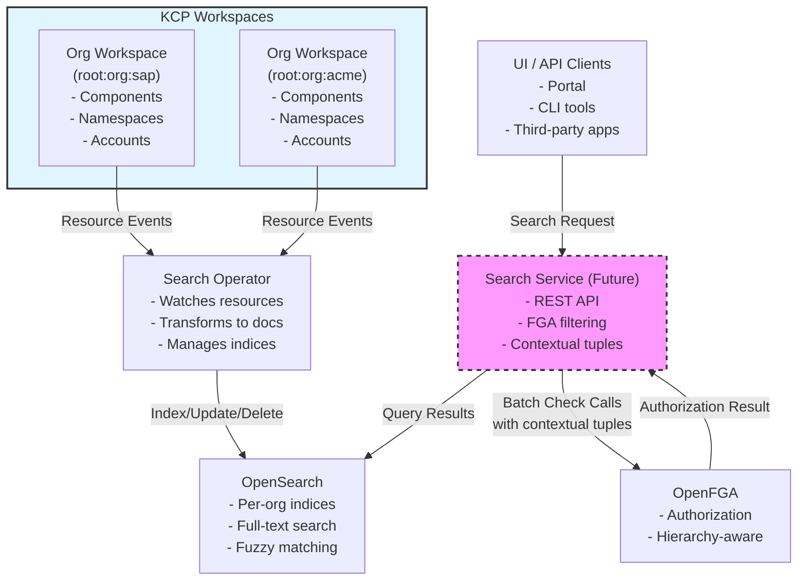

# RFC-001 Search Architecture for Platform Mesh

Status: Draft
Authors: Platform Mesh Team
Date: 2026-02-17

## Summary

This RFC proposes a generic search engine architecture for Platform Mesh that enables advanced searching capabilities (partial word search, fuzzy search, semantic search) across KCP resources with fine-grained authorization using OpenFGA. The architecture introduces a `SearchIndex` APIResourceSchema and a search operator that integrates with OpenSearch to provide per-organization search indices and handles indexing of a various APIResources.

## Context and Problem Statement

Currently Platform Mesh does not enable advanced searching such as partial word searches, fuzzy search, or semantic search. Every user must implement their own search architecture and permission management within the search and search index. This leads to:

- Duplicated effort across teams implementing search
- Inconsistent search experiences
- Complex authorization logic per implementation
- No unified way to discover resources across the platform


### Current State

Platform Mesh provides a KRM-based API surface through KCP, but lacks built-in search capabilities beyond basic Kubernetes list/watch operations. Users requiring advanced search must:

1. Deploy their own search infrastructure
2. Implement custom indexing logic
3. Manage search authorization separately from KCP/OpenFGA
4. Maintain synchronization between KCP resources and search indices

## Goals

- Provide a generic, reusable search architecture integrated with Platform Mesh
- Enable per-organization search indices with proper isolation
- Leverage OpenFGA for fine-grained authorization on search results
- Support configurable resource tracking (declarative indexing)
- Expose search through Platform Mesh as a standard API resource
- Enable future extensibility (AI-powered search, semantic search)

## Non-Goals

- Replacing KCP list/watch operations for real-time resource queries
- Providing search engine selection/pluggability (OpenSearch is the reference implementation)
- Supporting non-Kubernetes resource indexing in initial version
- Implementing search UI components (API-only)
- Supporting cross-organization search (security boundary)

## Approach

### Architecture Overview

The search architecture consists of four main components:

1. **SearchIndex APIResourceSchema**: Declares what index is used per organization
2. **Search Operator**: Reconciles/Initializes SearchIndex resources and manages indexing
3. **OpenSearch**: Backend search engine storing indexed documents
4. **Authorization Layer**: OpenFGA integration for filtering search results

**Architecture Diagram**:



**Component Interaction Flow**:

1. **Indexing Phase** (handled by Search Operator):
   - Search Operator watches KCP resources across workspaces
   - Transforms resources into search documents
   - Indexes them into per-organization OpenSearch indices
   - This happens continuously as resources are created/updated/deleted

2. **Search Phase** (handled by Search Service):
   - Users send search queries via Search Service (or directly to OpenSearch in POC)
   - Search Service queries OpenSearch and retrieves matching results
   - Results are filtered via OpenFGA batch checks with contextual tuples
   - Only authorized results are returned to the user

3. **Authorization**: Each search result is validated against FGA with hierarchy information (account, namespace) passed as contextual tuples

**Note**: Indexing and searching are completely separate concerns. The Search Operator handles all indexing operations, while the Search Service is only responsible for querying and authorization. In Phase 1 (POC), UIs/clients may query OpenSearch directly. The Search Service as a dedicated component is planned to provide a unified REST API, proper FGA integration, and additional features like query transformation and result ranking.

### SearchIndex Resource Schema

The `SearchIndex` resource is exposed through the `core.platform-mesh.io` APIExport and is available in organization workspaces. Eventually there should be a dedicated APIExport that is only used for search (e.g. called `search.platform-mesh.io`) and includes all exports of APIResources that should be searchable.

**API Group**: `core.platform-mesh.io`
**Alternative API Group**: `search.platform-mesh.io`
**Kind**: `SearchIndex`
**Scope**: Cluster

### Workspace Integration

#### Workspace Type Extension (POC Phase)

The search architecture integrates with the KCP workspace model through a dedicated workspace type:

**Workspace Type**: `search`
**Extends**: `org`
**Location**: `root:platform-mesh-system`

```yaml
apiVersion: tenancy.kcp.io/v1alpha1
kind: WorkspaceType
metadata:
  name: search
spec:
  extend:
    with:
      - name: org
  defaultAPIBindings:
    - exportName: core.platform-mesh.io
      permissionClaims:
        - group: core.platform-mesh.io
          resource: searchindices
  initializers:
    - search
```

The `org` workspace type is updated to extend `search`:

```yaml
apiVersion: tenancy.kcp.io/v1alpha1
kind: WorkspaceType
metadata:
  name: org
spec:
  extend:
    with:
      - name: security
      - name: search  # see reference [pull request](https://github.com/platform-mesh/platform-mesh-operator/pull/335)
```

This allows us to have an initializer listen to creations of everything that included in the workspace type.

#### Automatic Initialization

When a new organization workspace is created:

1. KCP applies the `search` initializer
2. The search-operator initializer deployment watches for new workspaces
3. A default `SearchIndex` resource is created in `root:platform-mesh-system`
4. The initializer removes itself from the workspace after successful creation

### Search Operator

The search operator is responsible for:

1. **Resource Indexing**: Index resources from defined APIExports
2. **Watch Management**: Establish watches on tracked resources
3. **Document Indexing**: Transform KRM resources to search documents
4. **Index Lifecycle**: Create, update, delete OpenSearch indices
5. **Status Management**: Update SearchIndex status conditions

**Operator Behavior**:

- Watches `root:platform-mesh-system` with elevated permissions
- Uses KCP kubeconfig for multi-workspace access
- Maintains one OpenSearch index per organization

**Phase 1 Scope - Static Resource Types**:

In the initial phase, the search operator works against a defined APIExport (e.g., `core.platform-mesh.io`) with known resource types that are explicitly configured for indexing. The operator is configured to index specific resource types such as:
- `Component`
- `Account`
- `Namespace`
- Other core resources as defined

**Future Scope - Dynamic Resource Discovery**:

Dynamic discovery of resources (reading APIExports to automatically discover available resources, handling providers that are added dynamically) is out of scope for the initial implementation and will be addressed in future iterations.

**Document Structure**:

Each indexed resource is stored as a JSON document containing:
- Full resource metadata (name, namespace, labels, annotations)
- Workspace path information (for organization isolation)
- Resource hierarchy data (account, namespace) needed for contextual tuple construction
- Relevant spec fields for search

For the POC, the structure will be the complete APIResource as JSON format, ensuring all information needed for FGA contextual tuples is available.

### OpenSearch Backend

**Deployment**:
- Single-node cluster for local development

**Index Naming Convention**:
```
{workspace-path-sanitized}-index
```
Example: `root-org-sap-account-dev-index`

**Configuration** (via search-operator):
```yaml
opensearch:
  url: "http://opensearch.platform-mesh-system.svc.cluster.local:9200"
  username: "admin"
  password:
    secretRef:
      name: opensearch-credentials
      key: password
```

### Authorization Integration

Search results are filtered based on OpenFGA tuples with contextual tuples for hierarchy-aware permissions:

1. User queries search endpoint (future work)
2. Search operator queries OpenSearch for matching documents
3. For each result, perform FGA batch check with contextual tuples: `batchCheck(user, 'view', resource, contextualTuples)`
4. Return only authorized results

**Authorization Flow**:

```
User Search Request
      │
      ▼
Search Operator
      │
      ├─────▶ OpenSearch Query ────▶ Raw Results
      │                                    │
      └─────▶ OpenFGA Batch Check ◀───────┘
                (with contextual tuples)
                     │
                     ▼
              Filtered Results
```

**Contextual Tuples for Hierarchy-Aware Authorization**:

Indexed documents contain all information needed to construct contextual tuples for FGA check calls. This allows the authorization layer to evaluate permissions based on the resource hierarchy without storing tuples for every resource-user combination.

**Example: Component Resource**

When a Component is indexed, the document contains:
```json
{
  "kind": "Component",
  "metadata": {
    "name": "my-component",
    "namespace": "my-namespace",
    "labels": {
      "account.platform-mesh.io/name": "my-account"
    }
  },
  "workspacePath": "root:org:sap:account-my-account:namespace-my-namespace",
  "spec": { ... }
}
```

During search result authorization, the operator extracts hierarchy information and performs:
```
batchCheck([
  {
    user: "user:alice",
    relation: "view",
    object: "component:my-component",
    contextual_tuples: [
      { user: "component:my-component", relation: "namespace", object: "namespace:my-namespace" },
      { user: "namespace:my-namespace", relation: "account", object: "account:my-account" }
    ]
  }
])
```

This allows FGA to evaluate permissions like:
- "Does Alice have view permission on the account?"
- "Does Alice have view permission on the namespace?"
- "Does Alice have direct view permission on the component?"

The indexed document structure ensures all required hierarchy data (account, namespace, workspace path) is available for constructing these contextual tuples without additional API calls.

## Implementation Roadmap

### Hackathon Stage (Completed)

- SearchIndex CRD with comprehensive spec/status schema
- Search Operator deployment with RBAC permissions
- OpenSearch integration (single-node, local dev)
- SearchIndex added to `core.platform-mesh.io` APIExport
- Multi-cluster KCP support via kubeconfig (configured via setup script for now)

**Repositories**:
- `platform-mesh-hackathon-0126/helm-charts`/`platform-mesh/search-operator` (for testing and POC)
- `platform-mesh/search-operator`/`platform-mesh/helm-charts` (for stable solution)

### POC Next Steps

1. **Workspace type `search` extending `org`**
   - PR: https://github.com/platform-mesh/platform-mesh-operator/pull/335
   - Repository: `platform-mesh/platform-mesh-operator`

2. **Initializer for auto-creating SearchIndex resources**
   - Creates SearchIndex resource in `root:platform-mesh-system`
   - Deletes initializer string after completion
   - File: `charts/search-operator/templates/initializer-deployment.yaml`

3. **Operator reconciliation logic for indexing**
   - Implement unstructured operator configurable via YAML or `config.go`
   - Discover resources via reading APIExport (core.platform-mesh.io)
   - Repository: `platform-mesh/search-operator`

### Platform Mesh Integration

1. Move existing changes from hackathon to `github.com/platform-mesh`
2. Implement resource discovery and indexing per organization (with FGA)
3. Expose search query endpoint
4. Production hardening (auth, persistence, backup/restore)

## Validation Steps

Validation commands for verifying search setup:

**In `:root:platform-mesh-system`:**

```bash
# Verify APIResourceSchema exists
kubectl get apiresourceschemas

# Verify APIBindings across all orgs
kubectl get apibindings \
  --server='https://kcp.api.portal.dev.local:8443/services/apiexport/1cklpfb2n05i2klh/core.platform-mesh.io/clusters/*/' \
  -A

# Verify SearchIndex resources can be queried
kubectl get searchindices \
  --server='https://kcp.api.portal.dev.local:8443/services/apiexport/1cklpfb2n05i2klh/core.platform-mesh.io/clusters/*/' \
  -A

# Verify API resources are registered
kubectl api-resources \
  --server='https://kcp.api.portal.dev.local:8443/services/apiexport/1cklpfb2n05i2klh/core.platform-mesh.io/clusters/*/'
```

**In `:root`:**

```bash
# Verify workspace types include search
kubectl get workspacetypes

# Verify search workspace type spec
kubectl get workspacetypes search -o yaml

# Verify org extends security and search
kubectl get workspacetypes org -o yaml
```

### Future Considerations

Features deferred to post-POC:

- **Search Engine Pluggability**: Support for Elasticsearch, (Solr)
- **AI-Powered Search**: Semantic search, natural language queries
- **External Resource Indexing**: Non-Kubernetes resources (databases, APIs)
